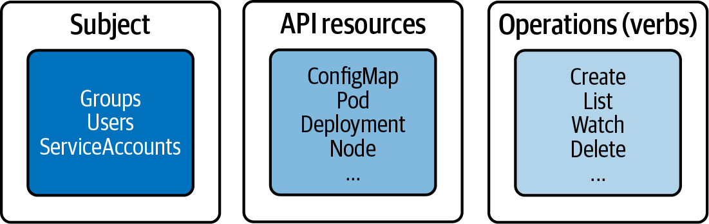

# RBAC

## Theory


RBAC helps to
- user + roles to access kubernetes resources
- Controlling processes running in a Pod and the operations they can perform via
the Kubernetes API
- Limiting the visibility of certain resources per namespace

Storage:
- ETCD: service accounts
- not ETCD: users and groups


Auth methods:
- mTLS X.509 Client Cert
- Basic Auth
- Bearer Token (OpenID / webhooks)

https://kubernetes.io/docs/reference/kubectl/generated/kubectl_config/kubectl_config_set-credentials/


## User creation
1. Create a private key 
2. CSR `openssl req -new -key johndoe.key -out johndoe.csr -subj "/CN=johndoe/O=cka-study-guide"`
   - Here `O=` stays for the group
3. Sign the CSR with cluster ca cert (this happens in the server; we accept all certs, signed by us; we do not store any information about the user on the server, when we do it this way)
   - The ca-Certs are stored in `/etc/kubernetes/pki` or `~/.minikube/`
4. Add user to the config (this happends on the client machine; server never gets the private key)
   1. `kubectl config set-credentials johndoe --client-certificate=johndoe.crt --client-key=johndoe.key`
5. Create context
   1. `kubectl config set-context johndoe-context --cluster=minikube --user=johndoe`
6. Switch to context
   1. `kubectl config use-context johndoe-context`
   2. `kubectl config current-context`
7. At this point the user does not have any access rights

## Service-Accounts

`kubectl create serviceaccount build-bot`

```yaml
# build-bot-sa.yaml
apiVersion: v1
kind: ServiceAccount
metadata:
   name: build-bot
```

List ServiceAccounts `k get sa`

Assign to a pod (**depricated**) 
`kubectl run build-observer --image=alpine --restart=Never --serviceaccount=build-bot`

