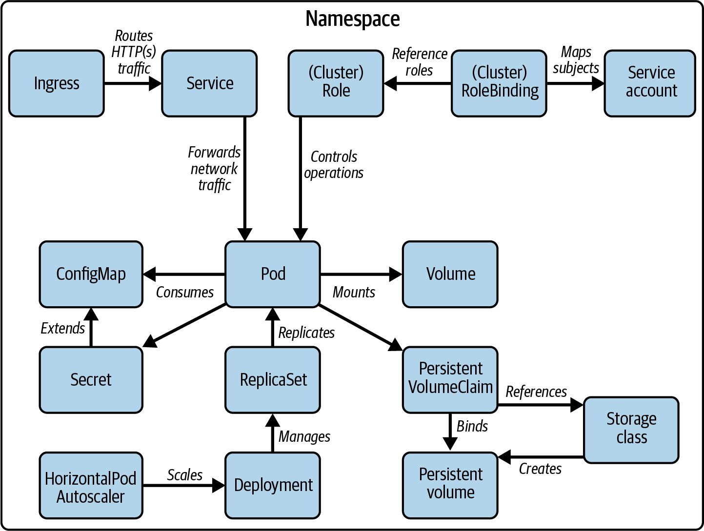

# Certification

  - Take me to [Video Tutorial](https://kodekloud.com/topic/certification/)
  
## Certification Details

   - **`Certified Kubernetes Administrator`**: https://www.cncf.io/certification/cka/

   - **`Exam Curriculum (Topics)`**: https://github.com/cncf/curriculum

   - **`Candidate Handbook`**: https://www.cncf.io/certification/candidate-handbook

   - **`Exam Tips`**: http://training.linuxfoundation.org/go//Important-Tips-CKA-CKAD

#### Use the code - KUBERNETES15 - while registering for the CKA or CKAD exams at Linux Foundation to get a 15% discount.

## Exam relevant staff

Pages allowed during exam
- https://kubernetes.io/docs/home/
- https://github.com/kubernetes/
- https://kubernetes.io/blog/

Exam FAQ: 
- https://docs.linuxfoundation.org/tc-docs/certification/faq-cka-ckad-cks
- https://docs.linuxfoundation.org/tc-docs/certification/tips-cka-and-ckad#cka-and-ckad-environment 
- https://kubernetes.io/docs/tasks/tools/install-kubectl-linux/#enable-shell-autocompletion 

Tools to be aware of:
- The exam may ask you to install a Kubernetes cluster from scratch. Read up
on the basics of Kubernetes and its architectural components. Don’t expect to
encounter any multiple-choice questions during the exam.
- kubectl command-line tool
- kubeadm (cluster installation / upgrade)
- etcdctl (incl. backing up and restoring the etcd)
- YAML syntax, data types, and indentation
- vim for editing
- bash

Orga:
- 2h
- 66%+ correct
