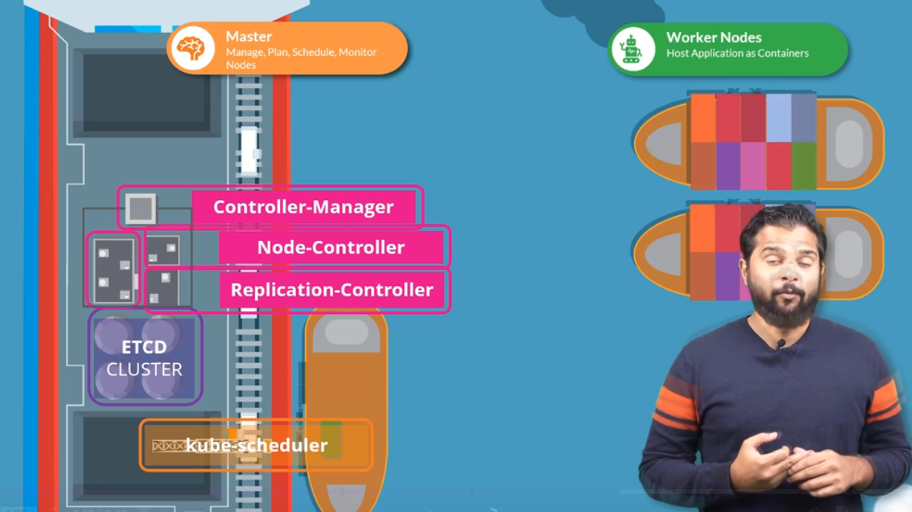

# Cluster Architecture

  - Take me to [Video Tutorial](https://kodekloud.com/topic/cluster-architecture/)

In this section , we will take a look at the kubernetes Architecture at high level.
- 10,000 Feet Look at the Kubernetes Architecture

  

- kube-apiserver connects controller, etcd and kube-scheduler
- container runtime engine  = docker / containerd / rkt
  - CRI (container runtime interface)
   
  

- wokernode: kubelet & kube-proxy

K8s Reference Docs:
- https://kubernetes.io/docs/concepts/architecture/

