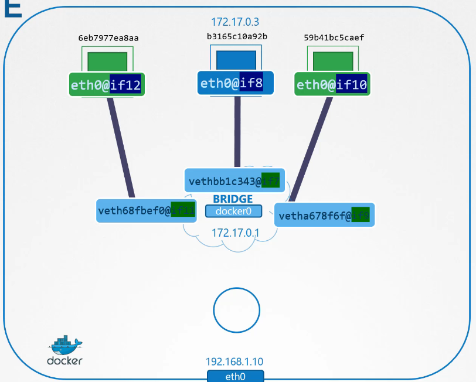

# Pre-requisite Docker Networking

  - Take me to [Lecture](https://kodekloud.com/topic/prerequsite-docker-networking/)

In this section, we will take a look at **Docker Networking**

## None Network

- Running docker container with `none` network

```
$ docker run --network none nginx
```

## Host Network

- Running docker container with `host` network

```
$ docker run --network host nginx
```

## Bridge Network

- Running docker container with `bridge` network

```
$ docker run --network bridge nginx
```

## List the Docker Network

```
$ docker network ls
NETWORK ID          NAME                DRIVER              SCOPE
4974cba36c8e        bridge              bridge              local
0e7b30a6c996        host                host                local
a4b19b17d2c5        none                null                local

```

## To view the Network Device on the Host  

```
$ ip link
or
$ ip link show docker0
3: docker0: <NO-CARRIER,BROADCAST,MULTICAST,UP> mtu 1500 qdisc noqueue state DOWN mode DEFAULT group default
    link/ether 02:42:cf:c3:df:f5 brd ff:ff:ff:ff:ff:ff
```

- With the help of `ip link add` command to type set `bridge` to `docker0`

```
$ ip link add docker0 type bridge
```

## To view the IP Addr of the interface docker0

```
$ ip addr
or
$ ip addr show docker0
3: docker0: <NO-CARRIER,BROADCAST,MULTICAST,UP> mtu 1500 qdisc noqueue state DOWN group default
    link/ether 02:42:cf:c3:df:f5 brd ff:ff:ff:ff:ff:ff
    inet 172.18.0.1/24 brd 172.18.0.255 scope global docker0
       valid_lft forever preferred_lft forever
```

## Run the command to create a Docker Container

```
$ docker run nginx
```

## To list the Network Namespace

```
$ ip netns
1c452d473e2a (id: 2)
db732004aa9b (id: 1)
04acb487a641 (id: 0)
default

# Inspect the Docker Container

$ docker inspect <container-id>

# To view the interface attached with the local bridge docker0

$ ip link
3: docker0: <BROADCAST,MULTICAST,UP,LOWER_UP> mtu 1500 qdisc noqueue state UP mode DEFAULT group default
    link/ether 02:42:c8:3a:ea:67 brd ff:ff:ff:ff:ff:ff
5: vetha3e33331@if3: <BROADCAST,MULTICAST,UP,LOWER_UP> mtu 1500 qdisc noqueue master docker0 state UP mode DEFAULT group default
    link/ether e2:b2:ad:c9:8b:98 brd ff:ff:ff:ff:ff:ff link-netnsid 0

# with -n options with the network namespace to view the other end of the interface

$ ip -n 04acb487a641 link
1: lo: <LOOPBACK,UP,LOWER_UP> mtu 65536 qdisc noqueue state UNKNOWN mode DEFAULT group default qlen 1000
    link/loopback 00:00:00:00:00:00 brd 00:00:00:00:00:00
3: eth0@if5: <BROADCAST,MULTICAST,UP,LOWER_UP> mtu 1500 qdisc noqueue state UP mode DEFAULT group default
    link/ether c6:f3:ca:12:5e:74 brd ff:ff:ff:ff:ff:ff link-netnsid 0

# To view the IP Addr assigned to this interface 

$ ip -n 04acb487a641 addr
3: eth0@if5: <BROADCAST,MULTICAST,UP,LOWER_UP> mtu 1500 qdisc noqueue state UP group default
    link/ether c6:f3:ca:12:5e:74 brd ff:ff:ff:ff:ff:ff link-netnsid 0
    inet 10.244.0.2/24 scope global eth0
       valid_lft forever preferred_lft forever
```

## Port Mapping

- Creating a docker container.

```
$ docker run -itd --name nginx nginx
d74ca9d57c1d8983db2c590df2fdd109e07e1972d6b361a6ecad8a942af5bf7e
```

- Inspect the docker container to view the IPAddress.

```
$ docker inspect nginx | grep -w IPAddress
            "IPAddress": "172.18.0.6",
                    "IPAddress": "172.18.0.6",
```

- Accessing web page with the `curl` command.

```
$ curl --head  http://172.18.0.6:80
HTTP/1.1 200 OK
Server: nginx/1.19.2
```

- Port Mapping to docker container

```
$ docker run -itd --name nginx -p 8080:80 nginx
e7387bbb2e2b6cc1d2096a080445a6b83f2faeb30be74c41741fe7891402f6b6
```

- Inspecting docker container to view the assgined ports.

```
$ docker inspect nginx | grep -w -A5 Ports

  "Ports": {
                "80/tcp": [
                    {
                        "HostIp": "0.0.0.0",
                        "HostPort": "8080"
                    }

```
- To view the IP Addr of the host system

```
$ ip a

# Accessing nginx page with curl command

$ curl --head http://192.168.10.11:8080
HTTP/1.1 200 OK
Server: nginx/1.19.2
```

- Configuring **iptables nat** rules

```
$ iptables \
         -t nat \
         -A PREROUTING \
         -j DNAT \
         --dport 8080 \
         --to-destination 80
```

```
$ iptables \
      -t nat \
      -A DOCKER \
      -j DNAT \
      --dport 8080 \
      --to-destination 172.18.0.6:80
```

## List the Iptables rules

```
$ iptables -nvL -t nat
```


#### References docs

- https://docs.docker.com/network/
- https://linux.die.net/man/8/iptables
- https://linux.die.net/man/8/ip