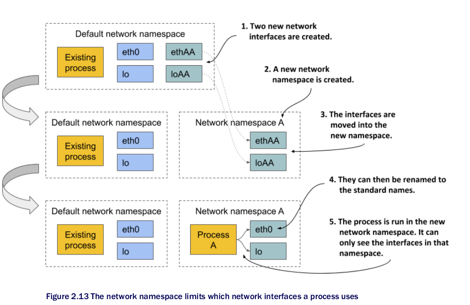

# Motivation vs VMs
- as services get smaller, individual VMs become too expensive


# Differences from VMs
- containers are more lightweight 
  - no additional os-processes are needed
  - no separate resource pool
  - no guest OSes
  - container is basically the isolated application process
- goal: one process per container to reduce the complexity
- 
  - Note: some hypervisors require a host OS, the other not
- 
- security risks of containers are higher since the kernel is shared
- also memory limitations are important
- Note: memory swapping is disabled in k8s!!!


# Docker
- it is a platform for packaging, distributing and running applications
- Image
  - app
  - libs
  - other files
- App does not have access to the host's fs (typically)
- The only thing to matter about the hosts linux distribution: the kernel version and the kernel modules it loads
  - if a needed kernel module is not in the host, app cannot run
  - hw architecture (arm/x86) is also fixed


# Layers
- Containers consist of reusable layers
- 
- docker stores each layer only once
- Copy-on-Write (CoW) mechanism (also happens on deletion, chown etc.)
- write layers are individual per container 
  


# Open Container Initiative
- OCI
- OCI Image Format Specification
- OCI Runtime Specification
- Kubernetes supports container runtime implementation via Container Runtime Interface (CRI)

- CRI-O is a lightweight alternative to docker
  - rkt, runC, Kata Containers
- 

# What makes containers possible
- linux namespaces
- cgroups
- capabilities 

## Linux namespaces
- each process has its own view of the system: restricted view on processes, files, network interfaces; different hostname
- initially there is only one namespace
- Types:
  - mnt namespaces
  - pid
    - 
  - net
    - each network interface belongs to exactly one ns, but is movable
    - 
  - ipc (inter-process communication): isolating messsage queues, shared memory
  - UNIX time sharing (UTS): hostname + network information servcei (NIS) domain name
  - user: user + group id


- Namespaces may be shared
  - 


- So, container is a process, to which 7 type of containers are assigned
- See https://blog.px.dev/container-filesystems/

## cgroup
- control groups root directory
  - cpu time, mem, network bandwith 

## Capabilities
- kernel privilegies
- examples
  - CAP_NET_ADMIN allows the process to perform network-related operations,
  - CAP_NET_BIND_SERVICE allows it to bind to port numbers less than 1024,
  - CAP_SYS_TIME allows it to modify the system clock, and so on.
- seccomp (secure computing mode): create custom profile by listing the allowed syscalls
- SELinux (security-enhanced linux)
  - attach labels to files, processes, users
  - labels should match to allow access
- AppArmor
  - like SELinux, but focuses on processes and uses paths


# Namespaces commands

Get namespaces of the process
```bash
# lsns -p 3130
        NS TYPE   NPROCS   PID USER  COMMAND
4026531834 time       59     1 root  /sbin/init
4026531837 user       59     1 root  /sbin/init
4026533872 ipc        15  2633 65535 /pause
4026533874 net        15  2633 65535 /pause
4026534025 mnt         1  3130 root  tail -n+1 -f /var/log/nginx/access.log
4026534026 uts         1  3130 root  tail -n+1 -f /var/log/nginx/access.log
4026534027 pid         1  3130 root  tail -n+1 -f /var/log/nginx/access.log
4026534028 cgroup      1  3130 root  tail -n+1 -f /var/log/nginx/access.log
```

Networking
```bash
root@minikube:/# nsenter -t 3130 -n ip a s
1: lo: <LOOPBACK,UP,LOWER_UP> mtu 65536 qdisc noqueue state UNKNOWN group default qlen 1000
    link/loopback 00:00:00:00:00:00 brd 00:00:00:00:00:00
    inet 127.0.0.1/8 scope host lo
       valid_lft forever preferred_lft forever
2: eth0@if6: <BROADCAST,MULTICAST,UP,LOWER_UP> mtu 1500 qdisc noqueue state UP group default 
    link/ether 72:33:d2:72:df:70 brd ff:ff:ff:ff:ff:ff link-netnsid 0
    inet 10.244.0.47/16 brd 10.244.255.255 scope global eth0
       valid_lft forever preferred_lft forever


root@minikube:/# nsenter -t 3130 -n ip route
default via 10.244.0.1 dev eth0 
10.244.0.0/16 dev eth0 proto kernel scope link src 10.244.0.47
```


Processes
```bash
root@minikube:/# nsenter -t 3130 -p -r ps -ef
PID   USER     TIME  COMMAND
    1 root      0:00 tail -n+1 -f /var/log/nginx/access.log
   79 root      0:00 ps -ef
```

Hostname
```bash
root@minikube:/# hostname
minikube
```

all namespaces
```bash
nsenter -t 3130 -a

df -h
```


