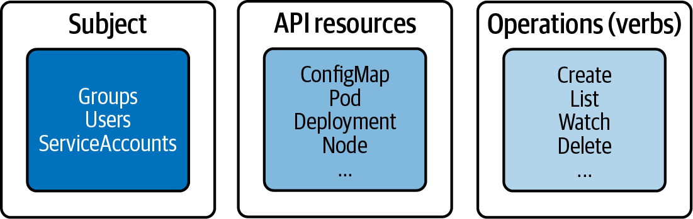

# RBAC

## Theory


RBAC helps to
- user + roles to access kubernetes resources
- Controlling processes running in a Pod and the operations they can perform via
the Kubernetes API
- Limiting the visibility of certain resources per namespace

Storage:
- ETCD: service accounts
- not ETCD: users and groups


Auth methods:
- mTLS X.509 Client Cert
- Basic Auth
- Bearer Token (OpenID / webhooks)

https://kubernetes.io/docs/reference/kubectl/generated/kubectl_config/kubectl_config_set-credentials/


- Role = Resource + Operations
- Operations not explicitly listed are disallowed 


Default ClusterRole
- cluster-admin: allows read and write access to resources across all namespaces.
- admin: allows read and write access to resources in all namespaces including Roles and RoleBindings.
- edit: allows   read and write access to resources in all namespaces except Roles and RoleBindings. Provides access to Secrets.
- view: allows read-only access to resources in all namespaces except Roles, RoleBindings, and Secrets


|         |    ClusterRole     |         Role         |
| :-----: | :----------------: | :------------------: |
|  Scope  |      Cluster       |      Namespace       |
| Objects |        Any         | Only namespaced once |
| Binding | ClusterRoleBinding |     RoleBinding      |

 


 


## User creation
1. Create a private key `openssl genrsa -out johndoe.key 2048`
2. CSR `openssl req -new -key johndoe.key -out johndoe.csr -subj "/CN=johndoe/O=cka-study-guide"`
   - Here `O=` stays for the group
3. Sign the CSR with cluster ca cert (this happens in the server; we accept all certs, signed by us; we do not store any information about the user on the server, when we do it this way)
   - The ca-Certs are stored in `/etc/kubernetes/pki` or `~/.minikube/`
   - `openssl x509 -req -in johndoe.csr -CA /.minikube/ca.crt -CAkey /.minikube/ca.key -CAcreateserial -out johndoe.crt -days 364`
4. Add user to the config (this happends on the client machine; server never gets the private key)
   1. `kubectl config set-credentials johndoe --client-certificate=johndoe.crt --client-key=johndoe.key`
5. Create context
   1. `kubectl config set-context johndoe-context --cluster=minikube --user=johndoe`
6. Switch to context
   1. `kubectl config use-context johndoe-context`
   2. `kubectl config current-context`
7. At this point the user does not have any access rights

## Service-Accounts

`kubectl create serviceaccount build-bot`

```yaml
# build-bot-sa.yaml
apiVersion: v1
kind: ServiceAccount
metadata:
   name: build-bot
```

List ServiceAccounts `k get sa`

Assign to a pod (**depricated**) 
`kubectl run build-observer --image=alpine --restart=Never --serviceaccount=build-bot`

```bash
kubectl exec -it  tmp -- cat /var/run/secrets/kubernetes.io/serviceaccount/token | sed 's/\s//g' | jq -R 'split(".") |.[0],.[1] | @base64d | fromjson'
```
```yaml
{
  "aud": [
    "https://kubernetes.default.svc.cluster.local",
    "k3s"
  ],
  "exp": 1767730241,
  "iat": 1736194241,
  "iss": "https://kubernetes.default.svc.cluster.local",
  "jti": "590a36a1-eea5-4269-a289-bb9583406d37",
  "kubernetes.io": {
    "namespace": "default",
    "node": {
      "name": "controlplane",
      "uid": "6fff1762-1ab1-4031-9247-e293a0ddad73"
    },
    "pod": {
      "name": "tmp",
      "uid": "3cf038d3-ab79-4075-a8e7-83521949d2bf"
    },
    "serviceaccount": {
      "name": "default",
      "uid": "1df6b13f-152e-412c-b4d4-f4de7cee1beb"
    },
    "warnafter": 1736197848
  },
  "nbf": 1736194241,
  "sub": "system:serviceaccount:default:default"
}
```


## Create role

`kubectl create role read-only --verb=list,get,watch --resource=pods,deployments,services`
 
Also user "*" to include all verbs.
Specify `--resource-name` to white-list resources.

```yaml
apiVersion: rbac.authorization.k8s.io/v1
kind: Role
metadata:
  creationTimestamp: null
  name: read-only
rules:
- apiGroups:
  - ""
  resources:
  - pods
  - services
  verbs:
  - list
  - get
  - watch
- apiGroups:
  - apps
  resources:
  - deployments
  verbs:
  - list
  - get
  - watch
```

ApiGroups: refer to `k api-resources`

## Role-Bindings

`k create rolebinding read-only-binding --role=read-only --user=johndoe `

```yaml
apiVersion: rbac.authorization.k8s.io/v1
kind: RoleBinding
metadata:
  creationTimestamp: null
  name: read-only-binding
roleRef:
  apiGroup: rbac.authorization.k8s.io
  kind: Role
  name: read-only
subjects:
- apiGroup: rbac.authorization.k8s.io
  kind: User
  name: johndoe
```


```bash
$ k auth can-i --list

Resources                                       Non-Res.URLs Res.Names Verbs
selfsubjectreviews.authent...      []           []          [create]
selfsubjectaccessreviews.author... []           []          [create]
selfsubjectrulesreviews.author...  []           []          [create]
                                   [/api/*]     []          [get]
                                   [/api]       []          [get]
                                   [/apis/*]    []          [get]
                                   [/apis]      []          [get]
                                   [/healthz]   []          [get]
                                   [/healthz]   []          [get]
                                   [/livez]     []          [get]
                                   [/livez]     []          [get]
                                   [/openapi/*] []          [get]
                                   [/openapi]   []          [get]
                                   [/readyz]    []          [get]
                                   [/readyz]    []          [get]
                                   [/version/]  []          [get]
                                   [/version/]  []          [get]
                                   [/version]   []          [get]
                                   [/version]   []          [get]
pods                               []           []          [list get watch]
services                           []           []          [list get watch]
deployments.apps                   []           []          [list get watch]

```


```bash 
$ k auth can-i --list --as minikube
```


## ClusterRole Aggregation

```yaml
# k create ClusterRole list-pods --resources pods --verbs list
apiVersion: rbac.authorization.k8s.io/v1
kind: ClusterRole
metadata:
  name: list-pods
  namespace: rbac-example
  labels:
    rbac-pod-list: "true"
rules:
- apiGroups:
  - ""
  resources:
  - pods
  verbs:
  - list
############
apiVersion: rbac.authorization.k8s.io/v1
kind: ClusterRole
metadata:
  name: delete-services
  namespace: rbac-example
  labels:
    rbac-service-delete: "true"
rules:
- apiGroups:
  - ""
  resources:
  - services
  verbs:
  - delete
###############
apiVersion: rbac.authorization.k8s.io/v1
kind: ClusterRole
metadata:
  name: pods-services-aggregation-rules
  namespace: rbac-example
aggregationRule:
  clusterRoleSelectors:
  - matchLabels:
      rbac-pod-list: "true"
  - matchLabels:
      rbac-service-delete: "true"
rules: []
```