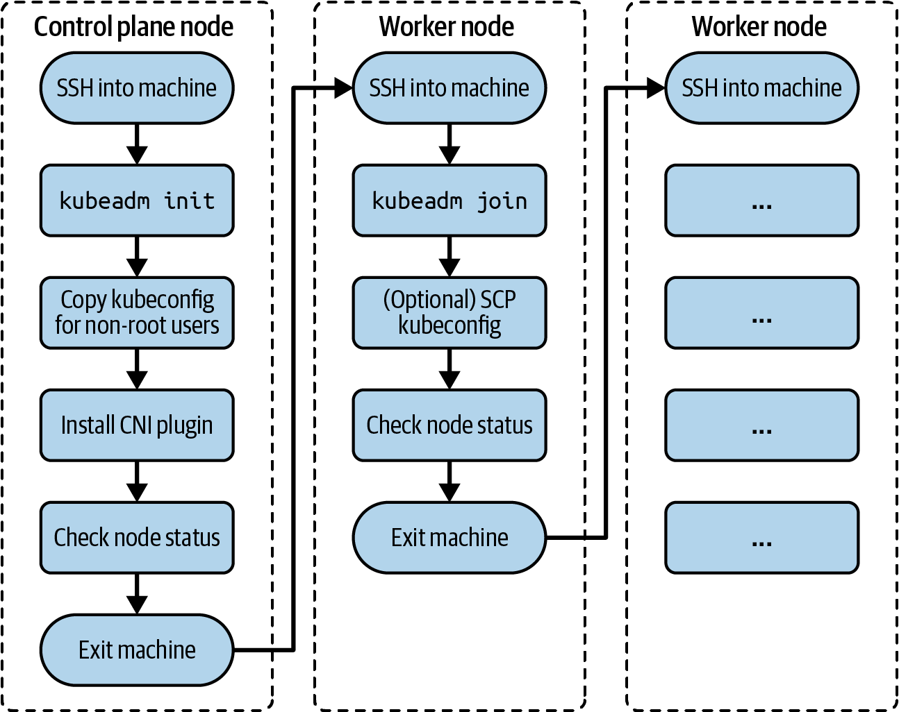

# Typical tasks
- bootstrapping a control plane
- bootstrapping worker nodes
- upgrading a cluster

# Responsibilities
- Terraform / Ansible: provision underlying infrastructure
- `kubeadm` bootstrap a cluster
  - https://kubernetes.io/docs/setup/production-environment/tools/kubeadm/install-kubeadm/
  - assume kubeadm is preinstalled during the CKA exam

# Installing a cluster

Single control plane and one worked node https://kubernetes.io/docs/setup/production-environment/tools/kubeadm/create-cluster-kubeadm/


## kubeadm init

- `--pod-network-cidr` ??
- `--apiserver-advertise-address` ??
- use `kubeadm token create --print-join-command` to get `kubeadmin join` command for workers

```bash
$ sudo kubeadm init --pod-network-cidr 172.18.0.0/16 \
--apiserver-advertise-address 10.8.8.10
...
To start using your cluster, you need to run the following as a regular user:

    mkdir -p $HOME/.kube
    sudo cp -i /etc/kubernetes/admin.conf $HOME/.kube/config
    sudo chown $(id -u):$(id -g) $HOME/.kube/config

You should now deploy a pod network to the cluster.

Run "kubectl apply -f [podnetwork].yaml" with one of the options listed at:
https://kubernetes.io/docs/concepts/cluster-administration/addons/

Then you can join any number of worker nodes by running the following on \
each as root:

kubeadm join 10.8.8.10:6443 --token fi8io0.dtkzsy9kws56dmsp \
    --discovery-token-ca-cert-hash \
    sha256:cc89ea1f82d5ec460e21b69476e0c052d691d0c52cce83fbd7e403559c1ebdac
```

## Container Networking Interface Plugin
- Plugin = addon
- Popular: Flannel, Calico, and Weave Net
- https://kubernetes.io/docs/concepts/extend-kubernetes/compute-storage-net/ network-plugins/
- https://kubernetes.io/docs/concepts/cluster-administration/addons/#networking-and-network-policy

Example for Weave.Net:
`kubectl apply -f "https://cloud.weave.works/k8s/net?k8s-version=$(kubectl version | base64 | tr -d '\n')"`
or
`kubectl apply -f https://github.com/weaveworks/weave/releases/download/v2.8.1/weave-daemonset-k8s.yaml`


## Worker-Node

```bash
$ sudo kubeadm join 10.8.8.10:6443 --token fi8io0.dtkzsy9kws56dmsp \
    --discovery-token-ca-cert-hash \
    sha256:cc89ea1f82d5ec460e21b69476e0c052d691d0c52cce83fbd7e403559c1ebdac
[preflight] Running pre-flight checks
[preflight] Reading configuration from the cluster...
[preflight] FYI: You can look at this config file with \
'kubectl -n kube-system get cm kubeadm-config -o yaml'
[kubelet-start] Writing kubelet configuration to file \
"/var/lib/kubelet/config.yaml"
[kubelet-start] Writing kubelet environment file with \
flags to file "/var/lib/kubelet/kubeadm-flags.env"
[kubelet-start] Starting the kubelet
[kubelet-start] Waiting for the kubelet to perform the TLS Bootstrap...

This node has joined the cluster:
* Certificate signing request was sent to apiserver and a response was received.
* The Kubelet was informed of the new secure connection details.

Run 'kubectl get nodes' on the control plane to see this node join the cluster.
```

If needed to call `kubectl` from workers, copy the admin kubeconfig
https://kubernetes.io/docs/setup/production-environment/tools/kubeadm/create-cluster-kubeadm/#optional-controlling-your-cluster-from-machines-other-than-the-control-plane-node

```bash
scp root@<control-plane-host>:/etc/kubernetes/admin.conf .
kubectl --kubeconfig ./admin.conf get nodes
```