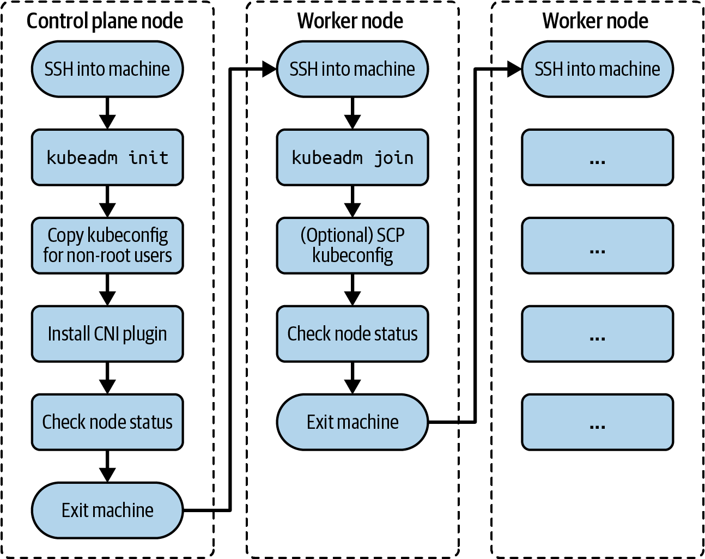
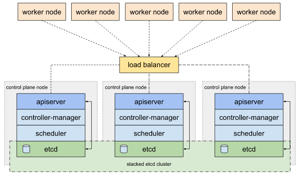
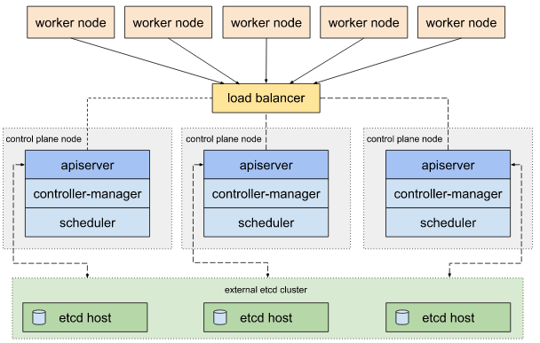
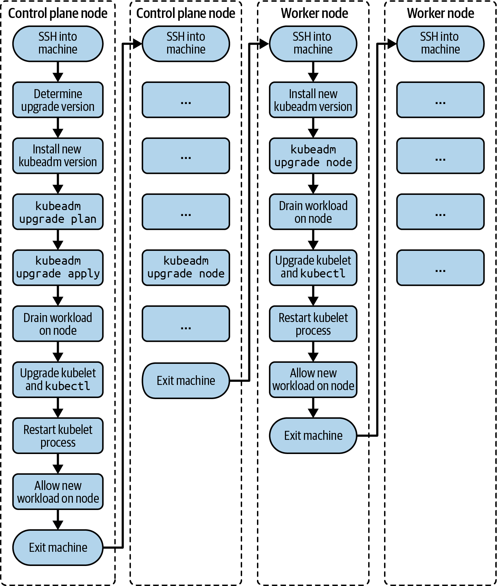
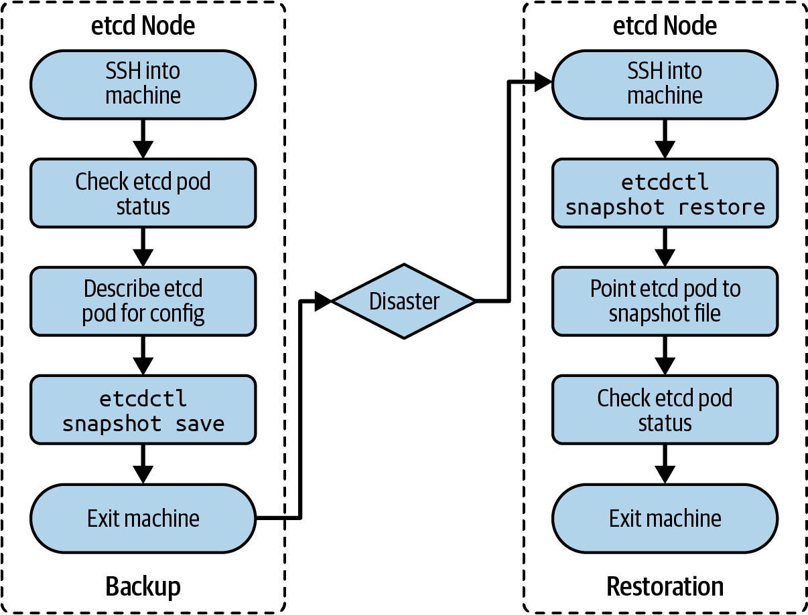

# Typical tasks
- bootstrapping a control plane
- bootstrapping worker nodes
- upgrading a cluster

# Responsibilities
- Terraform / Ansible: provision underlying infrastructure
- `kubeadm` bootstrap a cluster
  - https://kubernetes.io/docs/setup/production-environment/tools/kubeadm/install-kubeadm/
  - assume kubeadm is preinstalled during the CKA exam

# Installing a cluster

Single control plane and one worked node https://kubernetes.io/docs/setup/production-environment/tools/kubeadm/create-cluster-kubeadm/


install first containerd

## kubeadm init

- `--pod-network-cidr` -- see `ip a`
- `--apiserver-advertise-address` -- see `ip a` and `ip route`, port 6443 should be reachable from another nodes!!!
- use `kubeadm token create --print-join-command` to get `kubeadmin join` command for workers

```bash
$ sudo kubeadm init --pod-network-cidr 172.18.0.0/16 \
--apiserver-advertise-address 10.8.8.10
...
To start using your cluster, you need to run the following as a regular user:

    mkdir -p $HOME/.kube
    sudo cp -i /etc/kubernetes/admin.conf $HOME/.kube/config
    sudo chown $(id -u):$(id -g) $HOME/.kube/config

You should now deploy a pod network to the cluster.

Run "kubectl apply -f [podnetwork].yaml" with one of the options listed at:
https://kubernetes.io/docs/concepts/cluster-administration/addons/

Then you can join any number of worker nodes by running the following on \
each as root:

kubeadm join 10.8.8.10:6443 --token fi8io0.dtkzsy9kws56dmsp \
    --discovery-token-ca-cert-hash \
    sha256:cc89ea1f82d5ec460e21b69476e0c052d691d0c52cce83fbd7e403559c1ebdac
```

## Container Networking Interface Plugin
- Plugin = addon
- Popular: Flannel, Calico, and Weave Net
- https://kubernetes.io/docs/concepts/extend-kubernetes/compute-storage-net/ network-plugins/
- https://kubernetes.io/docs/concepts/cluster-administration/addons/#networking-and-network-policy

Example for Weave.Net:
`kubectl apply -f "https://cloud.weave.works/k8s/net?k8s-version=$(kubectl version | base64 | tr -d '\n')"`
or
`kubectl apply -f https://github.com/weaveworks/weave/releases/download/v2.8.1/weave-daemonset-k8s.yaml`


## Worker-Node

- user join with `--v=2` for logs 
```bash
$ sudo kubeadm join 10.8.8.10:6443 --token fi8io0.dtkzsy9kws56dmsp \
    --discovery-token-ca-cert-hash \
    sha256:cc89ea1f82d5ec460e21b69476e0c052d691d0c52cce83fbd7e403559c1ebdac
[preflight] Running pre-flight checks
[preflight] Reading configuration from the cluster...
[preflight] FYI: You can look at this config file with \
'kubectl -n kube-system get cm kubeadm-config -o yaml'
[kubelet-start] Writing kubelet configuration to file \
"/var/lib/kubelet/config.yaml"
[kubelet-start] Writing kubelet environment file with \
flags to file "/var/lib/kubelet/kubeadm-flags.env"
[kubelet-start] Starting the kubelet
[kubelet-start] Waiting for the kubelet to perform the TLS Bootstrap...

This node has joined the cluster:
* Certificate signing request was sent to apiserver and a response was received.
* The Kubelet was informed of the new secure connection details.

Run 'kubectl get nodes' on the control plane to see this node join the cluster.
```

If needed to call `kubectl` from workers, copy the admin kubeconfig
https://kubernetes.io/docs/setup/production-environment/tools/kubeadm/create-cluster-kubeadm/#optional-controlling-your-cluster-from-machines-other-than-the-control-plane-node

```bash
scp root@<control-plane-host>:/etc/kubernetes/admin.conf .
kubectl --kubeconfig ./admin.conf get nodes
```

## High availability cluster

https://kubernetes.io/docs/setup/production-environment/tools/kubeadm/ha-topology/
ETCD can either be colocated with the control plane (stacked), or run separately

Use `kubeadm join --control-plane` create a new control plane instance on current node (by default creates an ETCD instance).
- More instructions: https://kubernetes.io/docs/setup/production-environment/tools/kubeadm/high-availability/
- Odd number of nodes for easier leader selection
- The difference between stacked etcd and external etcd here is that the external etcd setup requires a configuration file with the etcd endpoints under the external object for etcd. In the case of the stacked etcd topology, this is managed automatically.


```bash
preflight              Run join pre-flight checks
control-plane-prepare  Prepare the machine for serving a control plane
  /download-certs        [EXPERIMENTAL] Download certificates shared among control-plane nodes from the kubeadm-certs Secret
  /certs                 Generate the certificates for the new control plane components
  /kubeconfig            Generate the kubeconfig for the new control plane components
  /control-plane         Generate the manifests for the new control plane components
kubelet-start          Write kubelet settings, certificates and (re)start the kubelet
control-plane-join     Join a machine as a control plane instance
  /etcd                  Add a new local etcd member
  /update-status         Register the new control-plane node into the ClusterStatus maintained in the kubeadm-config ConfigMap (DEPRECATED)
  /mark-control-plane    Mark a node as a control-plane
```

### Stacked etcd topology
- simpler to set up
- etcd communicate only with the apiserver
- control plane and respective etcd fail simultaneously
- min 3 control planes



### Separate ETCD
- loosing a control plane node has less impact
- twice the number of hosts
- min 3 control planes and 3 etcd nodes



### Number of control nodes
$$ \text{Quorum} = N/2 + 1 $$
If Quorum is not reached, cluster fails
$\text{Quorom}(2)=2$ -> So min 3 nodes

Odd vs even

Problem with even: e.g. 6, then Qurum is 4. If cluster breaks down due to Network connectivity into 2 equal groups, neither of them can achieve quorum.


## Upgrading Cluster version
- Upgarde from one minor version to a next one (or to a higher patch), e.g. 1.18 to 1.19. Avoid jumping over minor versions
- https://kubernetes.io/docs/tasks/administer-cluster/kubeadm/kubeadm-upgrade/




### Upgrade control plane
```bash
# uodate sources as described here
# [/etc/apt/sources.list.d/](https://kubernetes.io/blog/2023/08/15/pkgs-k8s-io-introduction/#how-to-migrate-deb)
$ sudo apt update
# https://kubernetes.io/docs/tasks/administer-cluster/kubeadm/kubeadm-upgrade/
$ sudo apt-cache madison kubeadm


# apt-mark unhold prevents the package from being automatically installed, upgraded or removed
$ sudo apt-mark unhold kubeadm && \
    sudo apt-get update && \
    sudo apt-get install -y kubeadm='1.19.0-00' && \
    sudo apt-mark hold kubeadm

# verify the version
$ kubeadm version 

# chooses the latest upgradable version (or we stick to our version)
# it may ask to upgrade kubeadm to this version
$ kubeadm upgrade plan

# it may also be needed to upgrade CNI
$ sudo kubeadm upgrade apply v1.29.0

$ kubectl drain kube-control-plane --ignore-daemonsets

# upgrade kubelet and kubectl
$ sudo apt-mark unhold kubelet kubectl && \
    sudo apt-get update && \
    sudo apt-get install -y kubelet=1.19.0-00 kubectl=1.19.0-00 && \
    sudo apt-mark hold kubelet kubectl
$ sudo systemctl daemon-reload
$ sudo systemctl restart kubelet

$ kubectl uncordon kube-control-plane

# verify
$ kubectl get nodes
```


### Upgrade a worker node
```bash
$ sudo apt-mark unhold kubeadm && \
    sudo apt-get update && \
    sudo apt-get install -y kubeadm=1.19.0-00 && \ 
    sudo apt-mark hold kubeadm

$ sudo kubeadm upgrade node

# View kubeadm config
# kubectl -n kube-system get cm kubeadm-config -o yaml

$ kubectl drain kube-worker-1 --ignore-daemonsets

$ sudo apt-mark unhold kubelet kubectl && \
    sudo apt-get update && \
    sudo apt-get install -y kubelet=1.19.0-00 kubectl=1.19.0-00 && \
    sudo apt-mark hold kubelet kubectl

$ sudo systemctl daemon-reload
$ sudo systemctl restart kubelet

$ kubectl uncordon kube-worker-1

# go to the cluster and verify the version
# or run kubectl from the worker, if 
# admin.conf  is there
$ kubectl get nodes
```


# ETCD Backup & Restore

## Installation
- https://github.com/etcd-io/etcd/releases


## Backup





# Troubleshooting when kubectl not available
```bash
crictl ps -a
crictl logs <container-id>


```
4a50bf20c4cd6

## Inspect Server Logs - Hardware setup
- Inspect server logs using journalctl
  ```
  $ journalctl -u etcd.service -l
  $ kubectl logs etcd-master
  $ docker ps -a
  $ docker logs <container-id>
  ```