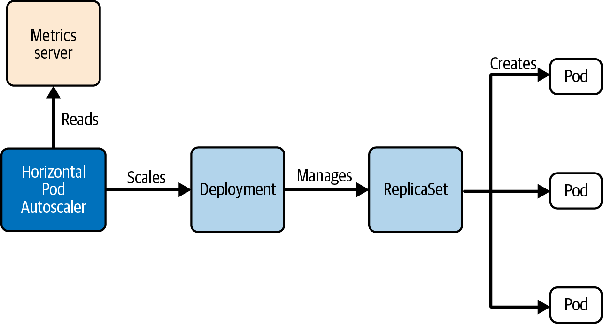
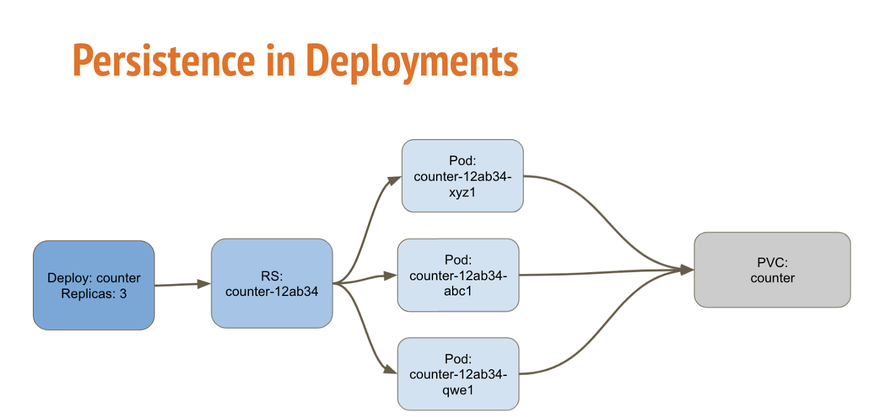
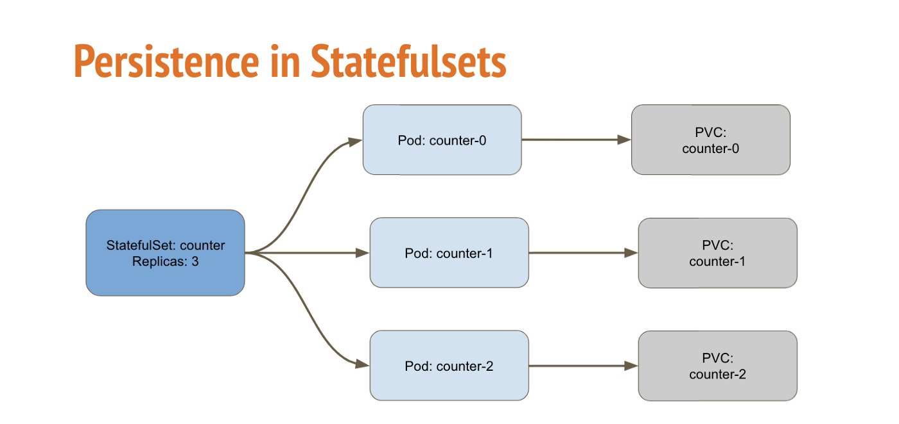
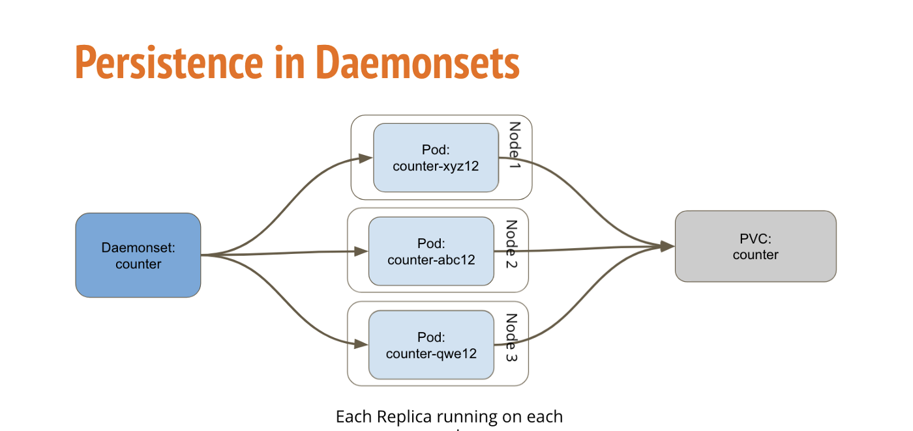

# Pod 

## Pod Problems / Flaws
- scalability
- failure tolerance

# ReplicaSet

Properties:
- controls replicas
- stable set of replicas
- rolling out a new version of pod
- purpose: availability
- Ownership
  - Links to pods via `metadata.ownerReferences` 
  - A ReplicaSet identifies new Pods to acquire by using its selector. If there is a Pod that has no OwnerReference or the OwnerReference is not a Controller and it matches a ReplicaSet's selector, it will be immediately acquired by said ReplicaSet
  - `.spec.template.metadata.labels` must match `spec.selector`, or it will be rejected by the API. 


# Deployment

Properties:
- incorporates a replicaset
- keeps version history and can rollback
- scaling of number of replicas
- same logic with labels as by ReplicaSet

```yaml
# kubectl create deployment app-cache --image=memcached:1.6.8 --replicas=4 --dry-run=client -o yaml

apiVersion: apps/v1
kind: Deployment
metadata:
  creationTimestamp: null
  labels:
    app: app-cache
  name: app-cache
spec:
  replicas: 4
  selector:
    matchLabels:
      app: app-cache
  template:
    metadata:
      creationTimestamp: null
      labels:
        app: app-cache
    spec:
      containers:
      - image: memcached:1.6.8
        name: memcached

```

## Use cases
https://kubernetes.io/docs/concepts/workloads/controllers/deployment/

- **Create a Deployment** to rollout a ReplicaSet. The ReplicaSet creates Pods in the background. Check the status of the rollout to see if it succeeds or not.
  - `kubectl rollout status deployment/nginx-deployment`
- **Declare the new state of the Pods** by updating the PodTemplateSpec of the Deployment. A new ReplicaSet is created and the Deployment manages moving the Pods from the old ReplicaSet to the new one at a controlled rate. Each new ReplicaSet updates the revision of the Deployment.
- **Rollback to an earlier Deployment revision** if the current state of the Deployment is not stable. Each rollback updates the revision of the Deployment.
- **Scale up the Deployment** to facilitate more load.
- **Pause the rollout** of a Deployment to apply multiple fixes to its PodTemplateSpec and then resume it to start a new rollout.
- **Use the status of the Deployment** as an indicator that a rollout has stuck.
- **Clean up older ReplicaSets** that you don't need anymore.


## Updating a deployment
Three ways:
- `set`: 
  - `kubectl set image deployment app-cache memcached=memcached:1.6.10 --record`
- `edit`:
- `apply`: edit the yaml definition and `k apply -f deploy.yaml` 

## Rollout History

```
$ kubectl rollout status deployment app-cache
Waiting for rollout to finish: 2 out of 4 new replicas have been updated...
deployment "app-cache" successfully rolled out

$ k rollout history deployment app-cache 
deployment.apps/app-cache 
REVISION  CHANGE-CAUSE
1         <none>
2         <none>

$ k rollout history deployment app-cache --revision 2
deployment.apps/app-cache with revision #2
Pod Template:
  Labels:	app=app-cache
	pod-template-hash=858b68bc5
  Containers:
   memcached:
    Image:	memcached:1.6.10
    Port:	<none>
    Host Port:	<none>
    Environment:	<none>
    Mounts:	<none>
  Volumes:	<none>

$ k rollout history deployment app-cache --revision 1
deployment.apps/app-cache with revision #1
Pod Template:
  Labels:	app=app-cache
	pod-template-hash=55d74ff68b
  Containers:
   memcached:
    Image:	memcached:1.6.8
    Port:	<none>
    Host Port:	<none>
    Environment:	<none>
    Mounts:	<none>
  Volumes:	<none>


```

## Rollback

```bash
$ kubectl rollout undo deployment app-cache --to-revision=1
deployment.apps/app-cache rolled back

# revision 1 turned into 3
$ k rollout history deployment app-cache 
deployment.apps/app-cache 
REVISION  CHANGE-CAUSE
2         <none>
3         <none>

```


## Scaling

- Manually: `kubectl scale deployment app-cache --replicas=6`
- Horizonal pod autoascaler (HPA)
  - Metrics server: https://kubernetes.io/docs/tasks/debug/debug-cluster/resource-metrics-pipeline/#metrics-server



### Create an HPA

See also [setup minikube](../03-Setup_minikube.md#metrics-server)


**Note**: describe may show strange errors / warnings / metric values at the beginning, but later it gets normal. I guess, it might depend on metrics-server and its refreshing rate (60s in my case).

```yaml
$ kubectl autoscale deployment app-cache --cpu-percent=80 --min=3 --max=5 --dry-run=client -o yaml
apiVersion: autoscaling/v1
kind: HorizontalPodAutoscaler
metadata:
  creationTimestamp: null
  name: app-cache
spec:
  maxReplicas: 5
  minReplicas: 3
  scaleTargetRef:
    apiVersion: apps/v1
    kind: Deployment
    name: app-cache
  targetCPUUtilizationPercentage: 80
status:
  currentReplicas: 0
  desiredReplicas: 0
---
# newer apiVersion
apiVersion: autoscaling/v2
kind: HorizontalPodAutoscaler
metadata:
  name: app-cache
  namespace: default
spec:
  minReplicas: 3
  maxReplicas: 5
  metrics:
  - type: Resource
    resource:
      name: cpu
      target:
        type: Utilization
        averageUtilization: 80
  scaleTargetRef:
    apiVersion: apps/v1
    kind: Deployment
    name: app-cache
```


Another option:
```yaml
# .spec.metrics
- type: Resource
  resource:
    name: memory
    target:
      type: AverageValue
      averageValue: 500Mi
```


```bash
$ k describe hpa app-cache 
...
Metrics:                                               ( current / target )
  resource cpu on pods  (as a percentage of request):  0% (1m) / 80%
Min replicas:                                          3
Max replicas:                                          5
Deployment pods:                                       3 current / 3 desired
Conditions:
  Type            Status  Reason            Message
  ----            ------  ------            -------
  AbleToScale     True    ReadyForNewScale  recommended size matches current size
  ScalingActive   True    ValidMetricFound  the HPA was able to successfully calculate a replica count from cpu resource utilization (percentage of request)
  ScalingLimited  True    TooFewReplicas    the desired replica count is less than the minimum replica count
Events:
  Type     Reason                        Age                    From                       Message
  ----     ------                        ----                   ----                       -------
  ...
  Normal   SuccessfulRescale             18s                    horizontal-pod-autoscaler  New size: 3; reason: All metrics below target
```


# StatefulSet

https://kubernetes.io/docs/concepts/workloads/controllers/statefulset/
- it is like deployment (contains a ReplicaSet)
- sticky identity for each pod
  - persistent identifier of each pod


Use cases:
- Stable, unique network identifiers.
  - DNS: web-{0..N-1}.nginx.default.svc.cluster.local
  - Hostname: web-{0..N-1}
- Stable, persistent storage.
- Ordered, graceful deployment and scaling.
- Ordered, automated rolling updates.

Vs deployment:
- Deployment - You specify a PersistentVolumeClaim that is shared by all pod replicas. In other words, shared volume.
- The backing storage obviously must have ReadWriteMany or ReadOnlyMany accessMode if you have more than one replica pod.
- StatefulSet - You specify a volumeClaimTemplates so that each replica pod gets a unique PersistentVolumeClaim associated with it. In other words, no shared volume.
- Here, the backing storage can have ReadWriteOnce accessMode.
- StatefulSet is useful for running things in cluster e.g Hadoop cluster, MySQL cluster, where each node has its own storage.






```yaml
apiVersion: v1
kind: Service
metadata:
  name: nginx
  labels:
    app: nginx
spec:
  ports:
  - port: 80
    name: web
  clusterIP: None
  selector:
    app: nginx
apiVersion: apps/v1
---
apiVersion: apps/v1
kind: StatefulSet
metadata:
  name: web
  labels:
    app: nginx
spec:
  selector:
    matchLabels:
      app: nginx # has to match .spec.template.metadata.labels
  serviceName: "nginx"
  replicas: 3 # by default is 1
  minReadySeconds: 10 # by default is 0
  template:
    metadata:
      labels:
        app: nginx # has to match .spec.selector.matchLabels
    spec:
      terminationGracePeriodSeconds: 10
      containers:
      - name: nginx
        image: registry.k8s.io/nginx-slim:0.8
        ports:
        - containerPort: 80
          name: web


```


```bash
$ k get statefulsets.apps,service,pods -l app=nginx
NAME                   READY   AGE
statefulset.apps/web   3/3     5m50s

NAME            TYPE        CLUSTER-IP   EXTERNAL-IP   PORT(S)   AGE
service/nginx   ClusterIP   None         <none>        80/TCP    6m29s

NAME        READY   STATUS    RESTARTS   AGE
pod/web-0   1/1     Running   0          5m50s
pod/web-1   1/1     Running   0          5m30s
pod/web-2   1/1     Running   0          5m10s
```


