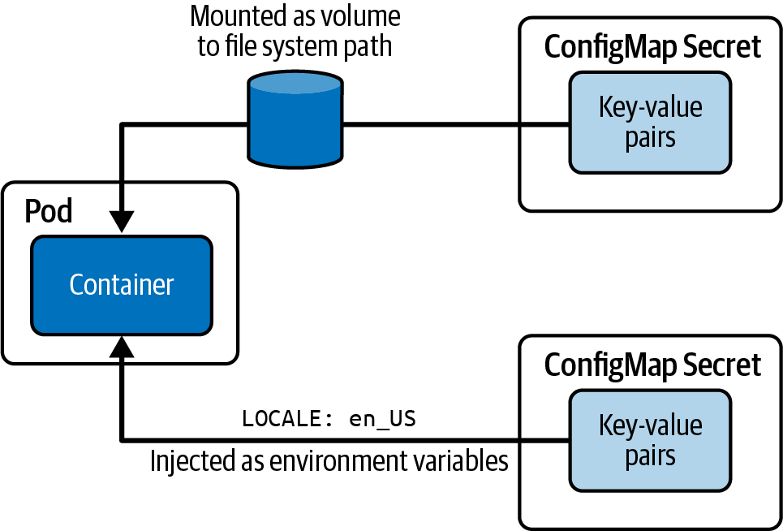

# Env in Pods 

`.spec.containers[].env`

```yaml
env:
- name: MEMCACHED_CONNECTIONS
  value: "2048"
- name: MEMCACHED_THREADS
  value: "150"
```


# ConfigMap



- `--from-literal=locale=en_US` Literal values, which are key-value pairs as plain text
- `-from-env-file=config.env` A file that contains key-value pairs and expects them to be environment variables (like output of `env`)
- `--from-file=app-config.json` A file with arbitrary contents
- `--from-file=config-dir` A directory with one or many files
 

```bash
$ kubectl create configmap db-config --from-literal=DB_HOST=mysql-service --from-literal=DB_USER=backend --dry-run=client -o yaml

apiVersion: v1
kind: ConfigMap
metadata:
  name: db-config
data:
  DB_HOST: mysql-service
  DB_USER: backend
```
## Updating config maps
https://github.com/kubernetes-sigs/kustomize/blob/master/examples/configGeneration.md
Changing the data held by a live ConfigMap in a cluster is considered bad practice. Deployments have no means to know that the ConfigMaps they refer to have changed, so such updates have no effect.

The recommended way to change a deployment's configuration is to
- create a new ConfigMap with a new name,
- patch the deployment, modifying the name value of the appropriate configMapKeyRef field.


## Injection of ConfigMaps
- `.spec.containers[].envFrom`
  ```yaml
  envFrom:
  - configMapRef:
      name: db-config
  ```
- `.spec.containers[].env`
  ```yaml
  env:
  - name: PLAYER_INITIAL_LIVES 
    valueFrom:
      configMapKeyRef:
        name: game-demo           
        key: player_initial_lives
  ```

Get env in a container:
```bash
$ k exec -it backend -- env
...
DB_HOST=mysql-service
DB_USER=backend
...
```


## Injection of ConfigMaps via Mounts as Files

### Example 1
```yaml
apiVersion: v1
kind: ConfigMap
metadata:
  name: game-demo
data:
  # property-like keys; each key maps to a simple value
  player_initial_lives: "3"
  ui_properties_file_name: "user-interface.properties"

  # file-like keys
  game.properties: |
    enemy.types=aliens,monsters
    player.maximum-lives=5    
  user-interface.properties: |
    color.good=purple
    color.bad=yellow
    allow.textmode=true    
```

```yaml
apiVersion: v1
kind: Pod
metadata:
  name: configmap-demo-pod
spec:
  containers:
   - name: demo
     ...
     volumeMounts:
     - name: config
       mountPath: "/config"
       readOnly: true
  volumes:
  - name: config
    configMap:
      name: game-demo
      # .items are optional
      items:
      - key: "game.properties"
        path: "game.properties"
      - key: "user-interface.properties"
        path: "user-interface.properties"
        
```


### Example 2

```json
# db.json
{
    "db": {
        "host": "mysql-service",
        "user": "backend"
    }
}
```

```bash
$ kubectl create configmap db-config-json --from-file=db.json --dry-run=client -o yaml
apiVersion: v1
kind: ConfigMap
metadata:
  name: db-config-json
data:
  db.json: "{\n\t\"db\": {\n\t\t\"host\": \"mysql-service\",\n\t\t\"user\": \"backend\"\n\t}\n}\n"
```

```yaml
apiVersion: v1
kind: Pod
metadata:
  name: backend
spec:
  containers:
  - image: bmuschko/web-app:1.0.1
    name: backend
    volumeMounts:
    - name: db-config-volume
      mountPath: /etc/config
    - name: db-config-json-volume
      mountPath: /etc/config/json #path must be unique
  volumes:
  - name: db-config-volume
    configMap:
      name: db-config
  - name: db-config-json-volume
    configMap:
      name: db-config-json
```

Results:
```bash
$ k exec -it backend -- ls /etc/config/{,json}
/etc/config/:
DB_HOST  DB_USER  json

/etc/config/json:
db.json

$ k exec -it backend -- cat /etc/config/DB_HOST
mysql-service

$ k exec -it backend -- cat /etc/config/DB_USER
backend

$ k exec -it backend -- cat /etc/config/json/db.json
{
	"db": {
		"host": "mysql-service",
		"user": "backend"
	}
}
```


# Secret
- generic: Creates a secret from a file, directory, or literal value.
- docker-registry: Creates a secret for use with a Docker registry.
- tls: Creates a TLS secret.
  - it has `.data.'tls.crt'` and `.data.'tls.key'` 
  - not obligatory, but good for standartization
- https://kubernetes.io/docs/concepts/configuration/secret/#secret-types


Same sources as by [ConfigMap](#configmap).

```bash
$ kubectl create secret generic db-creds --from-literal=pwd=s3cre! --dry-run=client -o=yaml

apiVersion: v1
kind: Secret
# type: Opaque # not output, =generic
metadata:
  name: db-creds
data:
  pwd: czNjcmUh

$ echo -n "s3cre!" | base64
czNjcmUh
```

`stringData` may be used instead of `data` to input values without base64 encoding
```yaml
apiVersion: v1
kind: Secret
# type: Opaque # not output, =generic
metadata:
  name: db-creds
stringData:
  pwd: s3cre!
```

## Injection of Secrets
- via `.spec.containers[].envFrom`
```yaml
apiVersion: v1
kind: Pod
metadata:
    name: backend
spec:
    containers:
    - image: bmuschko/web-app:1.0.1
      name: backend
      envFrom:
      - secretRef:
        name: secret-basic-auth
```

- `.spec.containers[].env`
```yaml
env:
- name: USERNAME 
  valueFrom:
    secretKeyRef:
      name: secret-basic-auth           
      key: username
```

## Injection of Secrets via Mounts as Files

```yaml
apiVersion: v1
kind: Pod
metadata:
    name: backend
spec:
    containers:
    - image: bmuschko/web-app:1.0.1
      name: backend
      volumeMounts:
      - name: ssh-volume
        mountPath: /var/app
        readOnly: true
    volumes:
    - name: ssh-volume
      secret:
        secretName: secret-ssh-auth
        # optional .items
        items:
        - key: username
          path: my-group/my-username        
```


# Summary

## Injection as env

- via `.spec.containers[].envFrom`
```yaml
envFrom:
- secretRef / configMapRef:
    name: secret-basic-auth
```

- `.spec.containers[].env`
```yaml
env:
- name: USERNAME 
  valueFrom:
    secretKeyRef / configMapKeyRef:
      name: secret-basic-auth           
      key: username
```


## Injection via Mounts as Files

- `.spec.containers[].volumeMounts` do

```yaml
volumeMounts:
- name: ssh-volume
  mountPath: /var/app
  readOnly: true
```

- AND `.spec.volumes` do

```yaml
volumes:
- name: ssh-volume
  secret / configMap:
    secretName / name: secret-ssh-auth
    # optional .items
    items:
    - key: username
      path: my-group/my-username        
```
