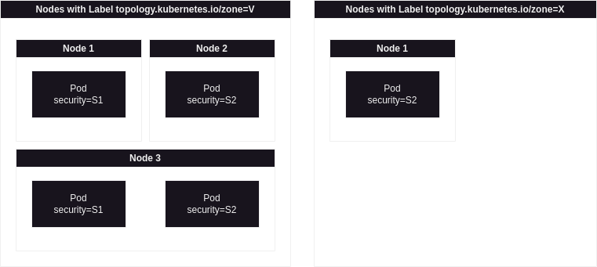

****


# Resource Requests
- Requests per Pod are summed up across the Containers. Scheduler takes care of it


- Requests
  - `spec.containers[].resources.requests.cpu`
  - `spec.containers[].resources.requests.memory`
  - `spec.containers[].resources.requests.huge-pages-<Size>`
    - Huge pages are a Linux-specific feature where the node kernel allocates blocks of memory that are much larger than the default page size.
    - e.g.`hugepages-2Mi: 80Mi`
    - For example, on a system where the default page size is 4KiB, you could specify a limit, `hugepages-2Mi: 80Mi`. If the container tries allocating over 40 2MiB huge pages (a total of 80 MiB), that allocation fails.
  - 
  - `spec.containers[].resources.requests.ephemeral-storage`
    - ephemeral = no long-term guarantee for durability
    - for scratch space (tmp data), caching, and for logs

- Memory specification. integer / fixed-point + suffix: 
  - Power-of-10: `m | "" | k | M | G | T | P | E`. 
  - Power-of-2: `Ki | Mi | Gi | Ti | Pi | Ei`
  - `5e6 = 5M` 
  - Roughly the same value: `128974848, 129e6, 129M,  128974848000m, 123Mi`
  - https://kubernetes.io/docs/reference/kubernetes-api/common-definitions/quantity/


- Example
```yaml
apiVersion: v1
kind: Pod
metadata:
  name: rate-limiter
spec:
  containers:
  - name: business-app
    image: bmuschko/nodejs-business-app:1.0.0
    ports:
    - containerPort: 8080
    resources:
      requests:
        memory: "256Mi"
        cpu: "1"
  - name: ambassador
    image: bmuschko/nodejs-ambassador:1.0.0
    ports:
    - containerPort: 8081
    resources:
      requests:
        memory: "64Mi"
        cpu: "250m"

```
- If not enough resources on any node:  `PodExceedsFreeCPU` or `PodExceedsFreeMemory`

# Resource Limits
https://kubernetes.io/docs/concepts/configuration/manage-resources-containers/#how-pods-with-resource-limits-are-run

- Exceeding limits may result 
  - in termination of application process running in the contianer
  - in prevention from acquiring further resources beyound limits
- CPU Limit
  - Linux kernel "pauses" the process (postpone the next scheduling interval)
  - Hard limit
  - CPU Request -> Weighting, if CPU resources become limited
- Memory Limits
  - Linux kernel out-of-memory (OOM) stops one of the processes in the container. If it's `PID 1`, container restarts (if possible)
  - If the whole node becomes short on memory while a pod exceed a memory limit, the pod will get evicted.
- Types
  - `spec.containers[].resources.limits.cpu`
  - `spec.containers[].resources.limits.memory`
  - `spec.containers[].resources.limits.huge-pages-<Size>`
  - `spec.containers[].resources.limits.ephemeral-storage`
- If `requests` are missing, they are copied from `limits`


Example:
```yaml
apiVersion: v1
kind: Pod
metadata:
  name: rate-limiter
spec:
  containers:
  - name: business-app
    image: bmuschko/nodejs-business-app:1.0.0
    ports:
    - containerPort: 8080
    resources:
      requests:
        memory: 256Mi
        cpu: 1000m 
      limits:
        memory: 512Mi
        cpu: 2000m    
  - name: ambassador
    image: bmuschko/nodejs-ambassador:1.0.0
    ports:
    - containerPort: 8081
    resources:
      requests:
        memory: 64Mi
        cpu: 250m
      limits:
        memory: 128Mi
        cpu: 500m  
```

# Recommendation on Limits and Requests
- https://home.robusta.dev/blog/stop-using-cpu-limits
  - do not use cpu-limits. Only cpu-requests
  - otherwise: if pod does not use to the the limit, this amount of cpu is wasted; if pod would benefit from more cpu, it cannot
- https://home.robusta.dev/blog/kubernetes-memory-limit
  - limit=request


# Node Labeling

```bash
$ kubectl get nodes --show-labels
NAME       STATUS   ROLES           AGE   VERSION   LABELS
minikube   Ready    control-plane   11d   v1.28.3   beta.kubernetes.io/arch=amd64,beta.kubernetes.io/os=linux,kubernetes.io/arch=amd64,kubernetes.io/hostname=minikube,kubernetes.io/os=linux,minikube.k8s.io/commit=8220a6eb95f0a4d75f7f2d7b14cef975f050512d,minikube.k8s.io/name=minikube,minikube.k8s.io/primary=true,minikube.k8s.io/updated_at=2024_01_13T23_51_40_0700,minikube.k8s.io/version=v1.32.0,node-role.kubernetes.io/control-plane=,node.kubernetes.io/exclude-from-external-load-balancers=
```


Add labels to node
```
kubectl label nodes <your-node-name> disktype=ssd
```


# Node-Selector
https://kubernetes.io/docs/concepts/scheduling-eviction/assign-pod-node/#nodeselector

Field `.spec.NodeSelector` (it does not support multiple labels simultaneously)
```yaml
apiVersion: v1
kind: Pod
metadata:
  name: nginx
  labels:
    env: test
spec:
  containers:
  - name: nginx
    image: nginx
    imagePullPolicy: IfNotPresent
  nodeSelector:
    disktype: ssd
```

Assinging to a concrete node `.spec.nodeName`:
```yaml
apiVersion: v1
kind: Pod
metadata:
  name: nginx
spec:
  nodeName: foo-node # schedule pod to specific node
  containers:
  - name: nginx
    image: nginx
    imagePullPolicy: IfNotPresent
```


Assign label to a node
```bash
$ kubectl label nodes <your-node-name> disktype=ssd
$ k get nodes --show-labels 
NAME       STATUS   ROLES           AGE   VERSION   LABELS
minikube   Ready    control-plane   17d   v1.28.3   beta.kubernetes.io/arch=amd64,beta.kubernetes.io/os=linux,kubernetes.io/arch=amd64,kubernetes.io/hostname=minikube,kubernetes.io/os=linux,minikube.k8s.io/commit=8220a6eb95f0a4d75f7f2d7b14cef975f050512d,minikube.k8s.io/name=minikube,minikube.k8s.io/primary=true,minikube.k8s.io/updated_at=2024_01_13T23_51_40_0700,minikube.k8s.io/version=v1.32.0,node-role.kubernetes.io/control-plane=,node.kubernetes.io/exclude-from-external-load-balancers=

$ k get nodes minikube -o jsonpath="{.metadata.labels}" | jq "."
{
  "beta.kubernetes.io/arch": "amd64",
  "beta.kubernetes.io/os": "linux",
  "kubernetes.io/arch": "amd64",
  "kubernetes.io/hostname": "minikube",
  "kubernetes.io/os": "linux",
  "minikube.k8s.io/commit": "8220a6eb95f0a4d75f7f2d7b14cef975f050512d",
  "minikube.k8s.io/name": "minikube",
  "minikube.k8s.io/primary": "true",
  "minikube.k8s.io/updated_at": "2024_01_13T23_51_40_0700",
  "minikube.k8s.io/version": "v1.32.0",
  "node-role.kubernetes.io/control-plane": "",
  "node.kubernetes.io/exclude-from-external-load-balancers": ""
}

```


# Affinity and Anti-affinity
https://kubernetes.io/docs/concepts/scheduling-eviction/assign-pod-node/#affinity-and-anti-affinity

- more expressive than `nodeSelector`
- possible to constrain on other pods rather than node labels (colocation of pods)
- two types
  - Nodes affinity
  - inter-pod affinity / anti-affinity

## Node Affinity
two types:
- `requiredDuringSchedulingIgnoredDuringExecution` (functions like `nodeSelector`)
- `preferredDuringSchedulingIgnoredDuringExecution` (if no match, pod will still be scheduled)

Note: `IgnoredDuringExecution` means, that label changes during execution does not force the pod to reschedule.

- Field `spec.affinity.nodeAffinity`
- Operators: `In`, `NotIn`, `Exists`, `DoesNotExist`, `Gt` and `Lt` (`Not`-Operators are anti-affinity). 
- `weight` is `1..100` (for preferred). Algorithm
  - Filter nodes meeting all requirements
  - Sum weight of the met matches for each node
  - This sum is added to the final score (it includes other priority functions)
- Note: syntax of required and preferred differ
  - `pod.spec.affinity.nodeAffinity. requiredDuringSchedulingIgnoredDuringExecution.nodeSelectorTerms.matchFields` are possible (same syntax, only supported field is `metadata.name`, see https://github.com/kubernetes/kubernetes/issues/61410)
  - `...preference.matchExpressions` or `...preference.matchFields` are also possible for `preferred`

```yaml
apiVersion: v1
kind: Pod
metadata:
  name: with-node-affinity
spec:
  affinity:
    nodeAffinity:
      requiredDuringSchedulingIgnoredDuringExecution:
        nodeSelectorTerms:
        - matchExpressions:
          - key: topology.kubernetes.io/zone
            operator: In
            values:
            - antarctica-east1
            - antarctica-west1
      preferredDuringSchedulingIgnoredDuringExecution:
      - weight: 1
        preference:
          matchExpressions:
          - key: another-node-label-key
            operator: In
            values:
            - another-node-label-value
  containers:
  - name: with-node-affinity
    image: registry.k8s.io/pause:2.0
```


To simulate `nodeSelector`:
```yaml
      requiredDuringSchedulingIgnoredDuringExecution:
        nodeSelectorTerms:
        - matchExpressions:
          - key: disktype
            operator: In
            values:
            - ssd
```
## Inter-pod Affinity and Anti-Affinity

Types:
- `requiredDuringSchedulingIgnoredDuringExecution`
- `preferredDuringSchedulingIgnoredDuringExecution`


Further:
- Field `spec.affinity.podAffinity` and `spec.affinity.podAntiAffinity`
- If pod satisfies own affinity rules, there will be no deadlock. If no other pod is running yet, it gets scheduled (if allowed by other rules)
- `topologyKey` is always a must
  - see https://kubernetes.io/docs/reference/labels-annotations-taints/ 
- `podAntiAffinity. requiredDuringSchedulingIgnoredDuringExecution` should have `topologyKey: kubernetes.io/hostname`
- Also `namespaceSelector` (same syntax as for labels) and `namespaces` (a list of allowed namespaces). If nothing specified: the same namespace is assumed

```yaml
apiVersion: v1
kind: Pod
metadata:
  name: with-pod-affinity
spec:
  affinity:
    podAffinity:
      requiredDuringSchedulingIgnoredDuringExecution:
      - labelSelector:
          matchExpressions:
          - key: security
            operator: In
            values:
            - S1
        topologyKey: topology.kubernetes.io/zone
    podAntiAffinity:
      preferredDuringSchedulingIgnoredDuringExecution:
      - weight: 100
        podAffinityTerm:
          labelSelector:
            matchExpressions:
            - key: security
              operator: In
              values:
              - S2
          topologyKey: topology.kubernetes.io/zone
  containers:
  - name: with-pod-affinity
    image: registry.k8s.io/pause:2.0

```

This pod won't get sceduled in Zone X, but rather on **any** Node in Zone V because of Node 1 & Node 3. Priority: 1, 2/3




**More explanation:**
- https://github.com/kubernetes/design-proposals-archive/blob/main/scheduling/podaffinity.md
- https://github.com/kubernetes/design-proposals-archive/blob/main/scheduling/podaffinity.md#examples
- Pod P
- Can only schedule P onto nodes that are running pods that satisfy P1. (Assumes all nodes have a label with key node and value specifying their node name.)
- Should try to schedule P onto zones that are running pods that satisfy P2. (Assumes all nodes have a label with key zone and value specifying their zone.)
- Cannot schedule P onto any racks that are running pods that satisfy P3. (Assumes all nodes have a label with key rack and value specifying their rack name.)
- Should try not to schedule P onto any power domains that are running pods that satisfy P4. (Assumes all nodes have a label with key power and value specifying their power domain.)

```json
PodAffinity {
	RequiredDuringScheduling: {{LabelSelector: P1, TopologyKey: "node"}},
	PreferredDuringScheduling: {{LabelSelector: P2, TopologyKey: "zone"}},
}
PodAntiAffinity {
	RequiredDuringScheduling: {{LabelSelector: P3, TopologyKey: "rack"}},
	PreferredDuringScheduling: {{LabelSelector: P4, TopologyKey: "power"}}
}
```


Use-cases:
- co-locate to reduce ping
- avoid placing cache-replicas on the same node
```yaml
apiVersion: apps/v1
kind: Deployment
metadata:
  name: redis-cache
spec:
  selector:
    matchLabels:
      app: store
  replicas: 3
  template:
    metadata:
      labels:
        app: store
    spec:
      affinity:
        podAntiAffinity:
          requiredDuringSchedulingIgnoredDuringExecution:
          - labelSelector:
              matchExpressions:
              - key: app
                operator: In
                values:
                - store
            topologyKey: "kubernetes.io/hostname"
      containers:
      - name: redis-server
        image: redis:3.2-alpine
```
- web-store is required to run on the same host as the cache and is forbidden to run on pods with another web-store
```yaml
apiVersion: apps/v1
kind: Deployment
metadata:
  name: web-server
spec:
  selector:
    matchLabels:
      app: web-store
  replicas: 3
  template:
    metadata:
      labels:
        app: web-store
    spec:
      affinity:
        podAntiAffinity:
          requiredDuringSchedulingIgnoredDuringExecution:
          - labelSelector:
              matchExpressions:
              - key: app
                operator: In
                values:
                - web-store
            topologyKey: "kubernetes.io/hostname"
        podAffinity:
          requiredDuringSchedulingIgnoredDuringExecution:
          - labelSelector:
              matchExpressions:
              - key: app
                operator: In
                values:
                - store
            topologyKey: "kubernetes.io/hostname"
      containers:
      - name: web-app
        image: nginx:1.16-alpine
```


# Taints and tolerations
- https://kubernetes.io/docs/concepts/scheduling-eviction/taint-and-toleration/
- https://github.com/kubernetes/design-proposals-archive/blob/main/scheduling/taint-toleration-dedicated.md
- > We expect that any real-world usage of taints and tolerations will employ an admission controller to apply the tolerations. 
- Taints and tolerations can be expressed via `nodeAffinity` (less expressively and cumbersome, ofc)

## General info

- Taint are added to nodes
  - `kubectl taint nodes node1 key1=value1:NoSchedule` This means that no pod will be able to schedule onto `node1` unless it has a matching toleration.
  - To remove the taint: `kubectl taint nodes node1 key1=value1:NoSchedule-`

- Tolerations are added to pods
  - the matching toleration `.spec.tolerations`:
  ```yaml
  tolerations:
  - key: "key1"
    operator: "Equal"
    value: "value1"
    effect: "NoSchedule"
  ```
  ```yaml
  tolerations:
  - key: "key1"
    operator: "Exists"
    effect: "NoSchedule"
  ```
- Operators: `Equal` and `Exists`
- Effects:
  - `NoExecute`
    - Pods that do not tolerate the taint are evicted immediately
    - Pods with tolerations and without `tolerationSeconds` remain forever
    - Pods with tolerations and with `tolerationSeconds` are evicted after that time elapses
  - `NoSchedule` 
    - Prevents from scheduling; no effect at execution time
  - `PreferNoSchedule`
    - a soft version
- Multiple tolerations / taints have `AND` effect

## Use cases

### Dedicated nodes
- `kubectl taint nodes nodename dedicated=groupName:NoSchedule`
- The pod should have this toleration
- To allow the pod to run only on these nodes, add the same label to the node and nodeAffinity to the pod.
- Another option: define a "non-dedicated" group: `dedicated=shared:NoSchedule` (tolerations are to be added via admission controller). This way only one special marking of a pod is needed.

### Nodes with special hardware
- e.g. if the node has GPUs, add a taint. Then pod will have to explicitly specifiy the toleration, if they need this hardware. Also affinity would be needed.
- For example, it is recommended to use [Extended Resources](https://kubernetes.io/docs/concepts/configuration/manage-resources-containers/#extended-resources) to represent the special hardware, taint your special hardware nodes with the extended resource name and run the [ExtendedResourceToleration](https://kubernetes.io/docs/reference/access-authn-authz/admission-controllers/#extendedresourcetoleration) admission controller. Add this resource request to the pod abd the `ExtendedResourceToleration` admission controller will add the tolerations automatically.

### Taint-based eviction
- the node controller automatically taints the node https://kubernetes.io/docs/concepts/scheduling-eviction/taint-and-toleration/#taint-based-evictions
  - `node.kubernetes.io/not-ready`
  - `node.kubernetes.io/unreachable`
  - `node.kubernetes.io/memory-pressure` etc.
  - drain results in adding `not-ready` and `unreachable`
  
- Prevent a pod from immediate rescheduling, when the node is unreachable
  ```yaml
  tolerations:
  - key: "node.kubernetes.io/unreachable"
    operator: "Exists"
    effect: "NoExecute"
    tolerationSeconds: 6000
  ```
  - Kubernetes automatically adds a toleration for `node.kubernetes.io/not-ready` and `node.kubernetes.io/unreachable` with `tolerationSeconds=300`
  - `DaemonSet` have this toleration without `tolerationSeconds`

### Taint nodes by condition
- Conditions are translated into tains, affecting scheduling this way


# Admission Controller
https://kubernetes.io/docs/reference/access-authn-authz/admission-controllers/
- intercepts requests after auth but before object creation
- validating / mutating
- enabled admission plugins: `kube-apiserver -h | grep enable-admission-plugins`
