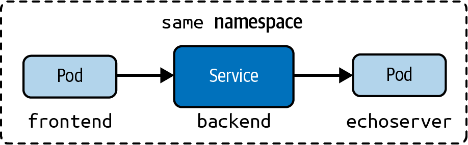
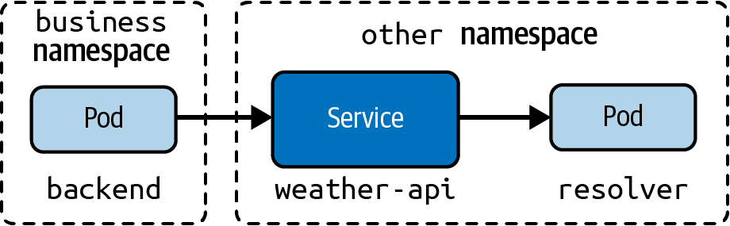
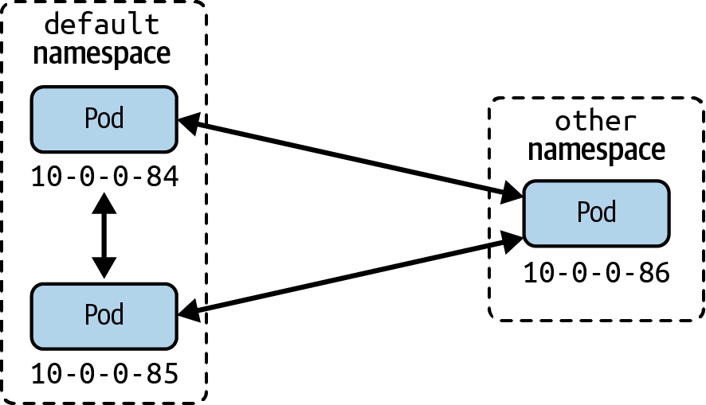

# Basics
- Intra Pod communication: inter process communication (IPC; messages), files, localhost calls
- Inter Pod: each pod gets an ephemeral IP in the cluster (from IP CIDR of the node)
- Pod2Service: stable DNS names + LB
- Node2Node: Node IP Addresses

# Intra Pod Communication
```yaml
apiVersion: v1
kind: Pod
metadata:
  name: multi-container
spec:
  containers:
  - image: nginx
    name: app
    ports:
    - containerPort: 80
  - image: curlimages/curl:7.79.1
    name: sidecar
    args:
    - /bin/sh
    - -c
    - 'while true; do curl localhost:80; sleep 5; done;'
```

Use cases of `.spec.conatainers.ports.containerPort`:
- if port defines a name, it can be referenced from a service by that name.
- https://stackoverflow.com/questions/57197095/why-do-we-need-a-port-containerport-in-a-kuberntes-deployment-container-definiti
- From https://kubernetes.io/docs/reference/generated/kubernetes-api/v1.22/#container-v1-core
> List of ports to expose from the container. Exposing a port here gives the system additional information about the network connections a container uses, but is primarily informational. Not specifying a port here DOES NOT prevent that port from being exposed. Any port which is listening on the default "0.0.0.0" address inside a container will be accessible from the network. Cannot be updated.
- → It is needed for documentation. Similar to docker expose: https://docs.docker.com/engine/reference/builder/#expose
> The EXPOSE instruction doesn't actually publish the port. It functions as a type of documentation between the person who builds the image and the person who runs the container, about which ports are intended to be published. 
- 3rd party products is istio and kiali https://kiali.io/docs/faq/graph/#why-are-there-many-unknown-nodes-in-the-graph
> For a more definitive solution, you could have these endpoints (like /health or /metrics) exposed on a different port and server than your main application, and to not declare this port in your Pod’s container definition as containerPort. This way, the requests will be completely ignored by the Istio proxy, as mentioned in Istio documentation (at the bottom of that page).


To check logs of a container: `kubectl logs multi-container -c sidecar`

# Inter Pod Communication
- Pod IPs are unique across the cluster
- Each node has a dedicated subnet
```bash
$ kubectl get nodes minikube -o jsonpath="{.spec.podCIDR}"
10.244.0.0/24
```
- Handled by kube-proxy + DNS + CNI (Container Network Interface)


# Services
- https://kubernetes.io/docs/concepts/services-networking/service/#services-without-selectors
- IP-agnostic, uses Kubernetes DNS control plane
- Complementary to deployments
- Types
  - `ClusterIP`: Exposes the Service on a cluster-internal IP. Only reachable from within the cluster.
  - `NodePort`: Exposes the Service on each node’s IP address at a static port. Accessible from outside of the cluster.
  - `LoadBalancer`: Exposes the Service externally using a cloud provider’s load balancer.


- Creation:
  - `kubectl create service clusterip echoserver --tcp=80:8080` See [result](./00-exercises/ex_chapter5/echoserver-service.yaml)
  - Create pod and service: `kubectl run echoserver --image=k8s.gcr.io/echoserver:1.10 --restart=Never --port=8080 --expose`
  - Create deployment and call `kubectl expose deployment echoserver --port=80 --target-port=8080`


- Listing / describing
  - `kubectl get services`
  - `kubectl describe service echoserver`
  - `kubectl get endpoints echoserver`
    - it's a dedicated resource
  
  ```yaml
  # kubectl get endpoints echoserver -n chapter5 -o yaml
  apiVersion: v1
  kind: Endpoints
  metadata:
    annotations:
      endpoints.kubernetes.io/last-change-trigger-time: "2024-02-12T12:56:00Z"
    creationTimestamp: "2024-02-12T12:56:00Z"
    labels:
      app: echoserver
    name: echoserver
    namespace: chapter5
    resourceVersion: "144542"
    uid: 8ac016cd-bc62-41f9-aa5c-1918a60036cc
  subsets:
  - addresses:
    - ip: 10.244.0.225
      nodeName: minikube
      targetRef:
        kind: Pod
        name: echoserver-59d8c477d6-xl6f9
        namespace: chapter5
        uid: 22bca097-a38f-43af-80b5-b7c1f27c4997
    - ip: 10.244.0.226
      nodeName: minikube
      targetRef:
        kind: Pod
        name: echoserver-59d8c477d6-26pp4
        namespace: chapter5
        uid: 6c16b2a1-0f44-41b7-85c3-3074ac0b3df8
    ports:
    - port: 8080
      protocol: TCP
  ```

## Port Mapping


## ServiceType ClusterIP

You cannot access the Service using the cluster IP and the port from your local
machine, illustrated by the following wget command:
`$ wget 10.106.223.154:80 --timeout=5 --tries=1` (gets rejected)


```bash
$ kubectl run tmp --image=busybox --restart=Never -it --rm -- wget 10.106.223.154:80 --timeout=5 --tries=1
Connecting to 10.106.223.154:80 (10.106.223.154:80)
saving to 'index.html'
index.html           100% |********************************|   431  0:00:00 ETA
'index.html' saved
pod "tmp" deleted

$ kubectl run tmp --image=busybox --restart=Never -it --rm -- wget echoserver-clusterip.chapter5.svc.cluster.local --timeout=5 --tries=1
# also works
```

## ServiceType NodePort

- Exposes access through the node’s IP address and can be resolved from outside of the Kubernetes cluster.
- ports 30000-32767, assigned automatically at service creation
- This port is opened on every node in the cluster, and its value is global and unique at the cluster-scope level
- `NodePort` (serviceType) vs `nodePort` (port number)
- See example [echoserver-nodePort-service.yaml](./00-exercises/ex_chapter5/echoserver-nodePort-service.yaml)
  - `.spec.ports[0].nodePort` is set to 30735 while `.spec.ports[0].port` is defined by us as 5005. `.spec.clusterIP` is `10.100.207.103`
  - 5005 is visible to the cluster: 
  - `kubectl run tmp --image=busybox --restart=Never -it --rm -- wget 10.105.80.38:5005`
  - using the service dns does not work!
  - 30735 is visible to the externals: 
  - `wget 192.168.49.2:30479 --timeout=5 --tries=1` (to get the ip: `k describe node minikube | grep InternalIP`)

**Note**: troubleshot bad services by inspecting endpoints. Example of not connected service:
```bash
$ k get endpoints -n chapter5 echoserver-clusterip -o yaml
apiVersion: v1
kind: Endpoints
metadata:
  annotations:´
    endpoints.kubernetes.io/last-change-trigger-time: "2024-02-12T21:46:48Z"
  creationTimestamp: "2024-02-12T21:46:48Z"
  labels:
    app: echoserver
  name: echoserver-clusterip
  namespace: chapter5
  resourceVersion: "149989"
  uid: 6a85e7a6-f85a-4dd5-9484-c36acb59acff
```


## ServiceType Loadbalancer
- exposes a single IP
- loadbalancing strategy is up to the external LB
- also not callable via dns
- See [echoserver-lb-service.yaml](./00-exercises/ex_chapter5/echoserver-lb-service.yaml/)


- Testing in minikube
  - https://minikube.sigs.k8s.io/docs/handbook/accessing/#run-tunnel-in-a-separate-terminal
  - Run in a separate terminal (it's an LB) `minikube tunnel` (may also ask for a pw)
  - not the lb service should get the external ip: `10.100.156.198`
  - now `wget 10.100.156.198:5005`
  - it lb also provides the `nodePort`, so that `wget 192.168.49.2:30209` is working
  

# Ingress
- only layer 7 (http/https)
- needs an ingress controller
- https://kubernetes.io/docs/concepts/services-networking/ingress-controllers/
  - NGINX Ingress Controller
  - minikube: `minikube addons enable ingress`
  - `k get pods,svc,deploy -n ingress-nginx`
  


## Ingress rules
- host (optional)
- paths
- backend (service and port)
- Path types: `Exact` (nuance: it does not tolerate trailing `/`) and `Prefix`
- See [corellian-ingress.yaml](./00-exercises/ex_chapter5/corellian-ingress.yaml)
- `curl --resolve "star-alliance.com:80:$( minikube ip )" -i http://star-alliance.com/corellian/api` (see https://kubernetes.io/docs/tasks/access-application-cluster/ingress-minikube/)
- alternative: add `$( minikube ip ) http://star-alliance.com` to `/etc/hosts`


# CoreDNS
- CoreDNS is a DNS server implementation in Kubernetes
- https://coredns.io
- also "CoreDNS" by John Belamaric & Cricket Liu
- `k get deploy -n kube-system coredns`
- It mounts a config `coredns` (more info on configuration: https://coredns.io/manual/toc/#configuration)
- customizing the mapping:
  - create a new cm `coredns-custom` (m.b. `coredns`??) in the ns `kube-system` and delete the pod (force deployment to reload it)


- Resolving from the same namespace
  - by hostname

```bash
$ kubectl run tmp -n chapter5 --image=busybox --restart=Never -it --rm -- wget echoserver-clusterip:80 --timeout=5 --tries=1
```



- Resolving from a different namespace
  - by hostname and namespace
  - the full hostname is `echoserver.other.svc.cluster.local`
  - in this case `svc` stands for service, and `cluster.local` is defined in the coredns cm

```bash
$ kubectl run tmp --image=busybox --restart=Never -it --rm -- wget echoserver-clusterip.chapter5:80 --timeout=5 --tries=1
```




- DNS for Pods
  - pods can communicate over IPs across Namespaces
  - CoreDNS config may have `pods insecure` option → DNS names with `-` instead of `.` will be created for pod IPs
  - this option may be disabled: `pods disabled`

```bash
# both work (use port 8080, because no service inbetween)
# by ip
$ kubectl run tmp --image=busybox --restart=Never -it --rm -n chapter5 -- wget 10.244.1.22:8080 --timeout=5 --tries=1
# by DNSed ip different ns
$ kubectl run tmp --image=busybox --restart=Never -it --rm -- wget 10-244-1-22.chapter5.pod:8080 --timeout=5 --tries=1

# not working without chapter5.pod
```




# Container Network Interface CNI
- consists of specification and libraries for writing plugins to configure network interfaces in Linux containers, along with a number of plugins
- Concerns: 
  - network connectivity of containers
  - removing allocated resources when the container is deleted


# Choosing a CNI Network Provider for Kubernetes
https://chrislovecnm.com/kubernetes/cni/choosing-a-cni-provider/
https://web.archive.org/web/20221207195504/https://chrislovecnm.com/kubernetes/cni/choosing-a-cni-provider/


Why Use CNI: default kubenet is limited (e.g. max 50 EC2)

Providers:
- Calico
- Canal (Flannel + Calico)
- flannel
- Weave Net
- kopeio-vxlan
- kube-router
- romana

Table
- Network Model
  - either encapsulated (VXLAN), or unencapsulated layer 2 . 
  - Encapsulating is theoretically slower
- Route Distribution
  - For layer 3 
  - typically via BGP
  - nice to have, if you plan to build clusters split across network segments
  - It is an exterior gateway protocol designed to exchange routing and reachability information on the internet
  - BGP can assist with pod to pod networking between clusters
- Network Policies
  - https://kubernetes.io/docs/concepts/services-networking/network-policies/
- Mesh
  - Pod2Pod Networking

| Provider          | Network Model      | Route Distribution | Network Policies | Mesh | External Datastore | Encryption | Ingress/Egress Policies | Commercial Support |
| ----------------- | ----------------- | ------------------ | ---------------- | ---- | ------------------ | ---------- | ----------------------- | ------------------ |
| Calico            | Layer 3           | Yes                | Yes              | Yes  | Etcd$^1$           | Yes        | Yes                     | Yes                |
| Canal             | Layer 2 vxlan     | N/A                | Yes              | No   | Etcd$^1$           | No         | Yes                     | No                 |
| flannel           | vxlan             | No                 | No               | No   | None               | No         | No                      | No                 |
| kopeio-networking | Layer 2 vxlan$^2$ | N/A                | No               | No   | None               | Yes$^3$    | No                      | No                 |
| kube-router       | Layer 3           | BGP                | Yes              | No   | No                 | No         | No                      | No                 |
| romana            | Layer 3           | OSPF               | Yes              | No   | Etcd               | No         | Yes                     | Yes                |
| Weave Net         | Layer 2 vxlan$^4$ | N/A                | Yes              | Yes  | No                 | Yes        | Yes$^5$                 | Yes                |

1. Calico and Canal include a feature to connect directly to Kubernetes, and not use Etcd.
2. kopeio CNI provider has three different networking modes: vlan, layer2, GRE, and IPSEC.
3. kopie-network provides encryptions in IPSEC mode, not the default vxlan mode.
4. Weave Net can operate in AWS-VPC mode without vxlan, but is limited to 50 nodes in EC2.
5. Weave Net does not have egress rules out of the box.

