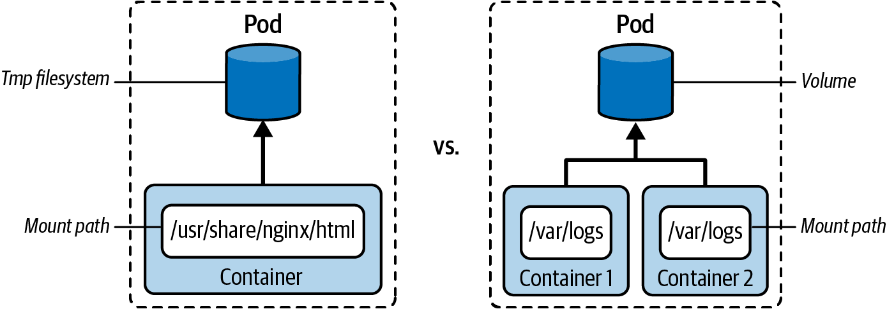
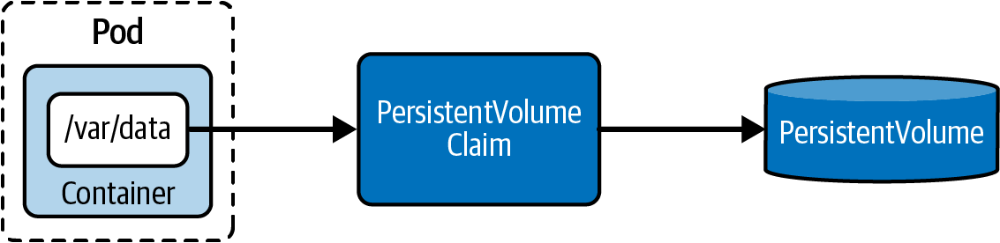

# Introduction
- The persistent volume persists data to an underlying physical storage
- The persistent volume claim connects the pod and the persistent volume
- The pod needs to claim  the PV and to mount it
- one the use cases: data exchange between containers


- Volume types
  - emptyDir: Empty directory in Pod with read/write access. Persisted for only the lifespan of a Pod. A good choice for cache implementations or data exchange between containers of a Pod. See [pod.yaml](./00-exercises/ex_chapter6/pod.yaml)
  - hostPath: File or directory from the host node’s filesystem.
  - configMap, secret: see [03-ConfigsAndSecrets.md](./03-ConfigsAndSecrets.md)
  - nfs: An existing Network File System (NFS) share. Preserves data after Pod restart
  - persistent VolumeClaim: see below.

- Create and access volume from pod:
  - `spec.volumes[]`
  - `spec.containers.volumeMounts[]`

# Persitent Volumes
- https://kubernetes.io/docs/concepts/storage/persistent-volumes/
- https://github.com/kubernetes/design-proposals-archive/blob/main/storage/persistent-storage.md

- a PV is either provided by an administrator or is assigned dynamically by mapping to a storage class
- a PV is completely decoupled from a pod

- Static Provisioning
  - only manifest approach (no `kubectl create` command)
    ```yaml
    apiVersion: v1
    kind: PersistentVolume
    metadata:
      name: db-pv
    spec:
      volumeMode: FileSystem
      persistentVolumeReclaimPolicy: Retain #default
      capacity:
        storage: 1Gi
      accessModes:
      - ReadWriteOnce
      hostPath:
      path: /data/db
    ```
  - Volume Modes:
    - `Filesystem`: Default. Mounts the volume into a directory of the consuming Pod. Creates a filesystem first if the volume is backed by a block device and the device is empty
    - `Block`: Used for a volume as a raw block device without a filesystem on it (in a pod it should be mounted as `.spec.containers.volumeDevices` instead of mount path)
  - Access mode:
    - `ReadWriteOnce` / `RWO`: Read/write access by a **single node**
    - `ReadOnlyMany` / `ROX`: Read-only access by many nodes
    - `ReadWriteMany` / `RWX`: Read/write access by many nodes
    - `ReadWriteOncePod` / `RWOP`: Read/write access mounted by a single Pod
  - Reclaim policy (what happens when PVC is deleted)
    - `Retain`: Default. When PersistentVolumeClaim is deleted, the PersistentVolume is “released” and can be reclaimed
    - `Delete`: Deletion removes PersistentVolume and its associated storage
- It is possible to specify `NodeAffinity` in the PV

# PVC

- Manifest
```yaml
kind: PersistentVolumeClaim
apiVersion: v1
metadata:
  name: db-pvc
spec:
  accessModes:
  - ReadWriteOnce
  storageClassName: "" 
  resources:
    requests:
      storage: 256Mi
```
- Claims that request the class `""` effectively disable dynamic provisioning for themselves
- The binding to an appropriate PersistentVolume happens automatically based on those criteria
  - The PV can be selected explicitly `spec.volumeName`
  - The binding may fail, if the PV is already claimed
  - To guarantee the binding: use in PV `.spec.claimRef`
  ```yaml
  claimRef:
    name: foo-pvc
    namespace: foo
  ```
- **Binding is 1-to-1**.
- See [pod.yaml](./00-exercises/ex_chapter6/pod.yaml)
- when mounted, the field "Used By" of pvc is set

# Storage Class
- https://kubernetes.io/docs/concepts/storage/storage-classes/
- https://github.com/kubernetes/design-proposals-archive/blob/main/storage/volume-provisioning.md
- The storage class is used to provision a PersistentVolume dynamically based on its criteria
- Kubernetes itself is unopinionated about what classes represent.
- `k describe storageclasses` (standard is defined by default)
- creation of a storageclass is only via manifests
- see [fast-sc.yaml](./00-exercises/ex_chapter6/fast-sc.yaml) and [db-pvc-standard.yaml](./00-exercises/ex_chapter6/db-pvc-standard.yaml)
