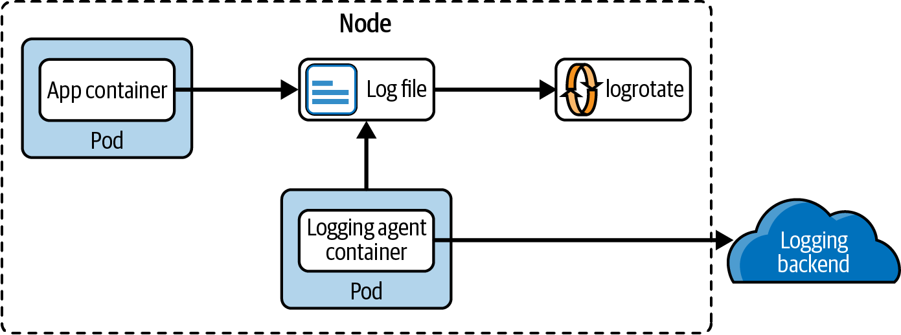
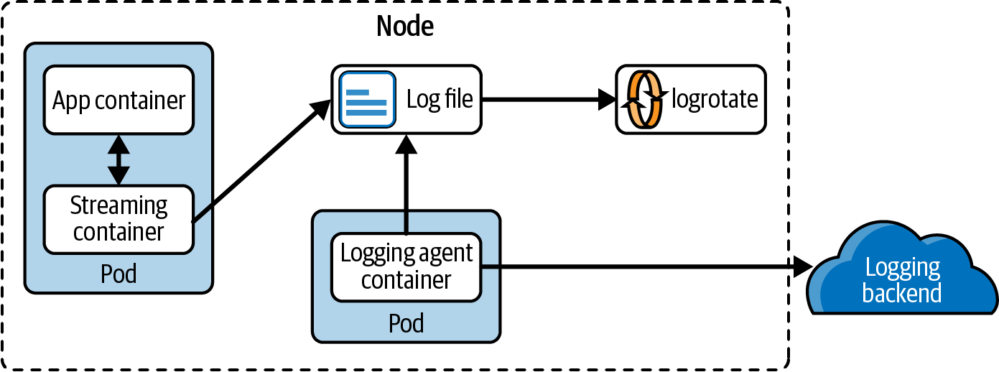
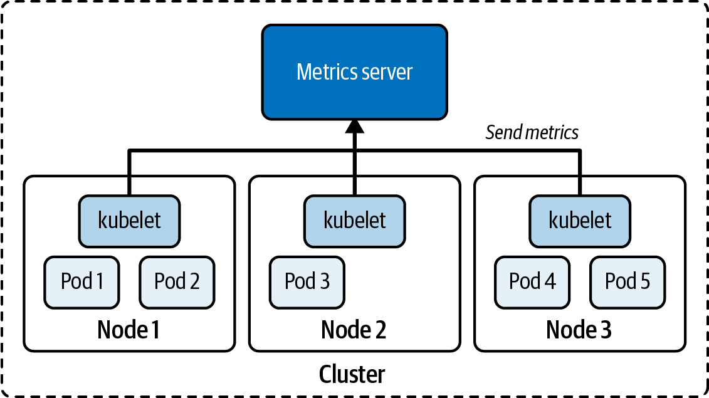
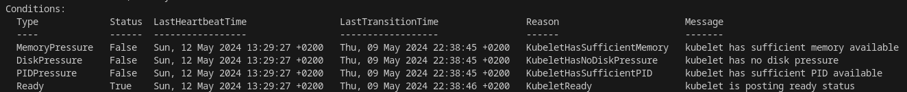

# Intro
- Cluster logging:
  - node-level
  - 
  - streaming sidecar
    - 
    - Use Case 1
      - if the main container writes to a file, restream to stdout
      - if several files, use different sidecars
      - then node-level agent picks these stdouts up and show in `kubectl logs`
      - if application writes to a single file, consider writing to `/dev/stdout` (for perfomance and storage reasons)
      - see [sidecar2](./00-exercises/ex_chapter7/sidecar/sidecars2.yaml)
    - Use Case 2
      - run logrotate 
  - logging agent sidecar
    - e.g. fluentd
  - pushing logs to backend from application
  - https://kubernetes.io/docs/concepts/cluster-administration/logging/#cluster-level-logging-architectures
  

# Node Logging
- kube-scheduler and kube-proxy run in a container --> same as for any other application container
- system components not in the container (e.g., the kubelet and the container runtime)
  - if systemd is available: logs will be written to journald . 
  - else: /var/log/...log

# Monitoring
- Typical metrics
  - number of nodes
  - health status of nodes
  - node performance metrics (cpu, memory, io)
  - pod-level performance
- 
- metrics are saved in memory and not persisted!
- `kubectl top nodes`

# Troubleshooting pods
- Typical pod error stati
  - ImagePullBackOff / ErrImagePull
  - CrashLoopBackOff: Application or command run in container crashes.
  - CreateContainerConfigError: CM/Secret is missing
- `kubectl describe podname` to check pod events
- `kubectl get events`
- `kubectl logs -n ns podname container --previous` for previous instantiation of the pod
- `kubectl exec failing-pod -it -- /bin/sh`

# Troubleshooting services
- check selectors & labels
- check endpoints `kubectl get endpoints myservice`
- run wget/curl tests
```bash
$ kubectl get services
NAME TYPE CLUSTER-IP EXTERNAL-IP PORT(S) AGE
myservice ClusterIP 10.99.155.165 <none> 80/TCP 15m
$ kubectl run tmp --image=busybox -it --rm -- wget -O- 10.99.155.165:80
...
```
- check ports exposed by service and container

# Troubleshooting nodes
- `kubectl get nodes`
- `kubectl cluster-info`
- `kubectl cluster-info dump`
- Componentes to inspect (`kubectl get pods -n kube-system`):
  - kube-apiserver: Exposes the Kubernetes API used by clients like kubectl for managing objects.
  - etcd: A key-value store for storing the cluster data.
  - kube-scheduler: Selects nodes for Pods that have been scheduled but not created.
  - kube-controller-manager: Runs controller processes (e.g., the job controller responsible for Job object execution).
    - https://kubernetes.io/docs/reference/command-line-tools-reference/kube-controller-manager/
    - a controller is a control loop that watches the shared state of the cluster through the apiserver and makes changes attempting to move the current state towards the desired state
    - Examples: replication controller, endpoints controller, namespace controller, and serviceaccounts controller.
  - cloud-controller-manager: Links cloud provider–specific API to the Kubernetes cluster. This controller is not available in on-premise cluster installations of Kubernetes
  - `kubectl logs kube-apiserver-minikube -n kube-system`

- Typical status is `NotReady`. Possible reasons:
  - Insufficient resources
  - Issues with the kubelet process
  - Issues with kube-proxy
- `kubectl describe node worker-1`
  - Conditions
  - 
  - SSH to the node and run 
    - `top`: check number of processes and memory
    - `df -h` check disc space
    - `systemctl status kubelet` (m.b. with `sudo`)
    - `journalctl -u kubelet.service`
    - `systemctl restart kubelet`
    - `openssl x509 -in /var/lib/kubelet/pki/kubelet.crt -text` (config directory is mentioned in `systemctl status`): check the expiration of certificate
    - `sudo systemctl daemon-reload` -- when changing the sytemd config or related files
    - `sudo systemctl restart kubectl`


- Check `kube-proxy` pod
  - `kubectl get pods -n kube-system -o wide` to see on which nodes it runs
  - Event logs:
    - `kubectl describe pod kube-proxy-csrww -n kube-system`
    - `kubectl describe ds kube-proxy -n kube-system`
  - Logs (only for pods)
    - `kubectl logs kube-proxy-csrww -n kube-system`
  - 

# Exercises Notes
- when testing an nginx endpoint: 
  - find the IP of the pod
  - check the default config of the nginx: `/etc/nginx/conf.d/default.conf` to get the exposed port and path
  - `kubectl run -n chapter7 --image busybox tmp --rm=true -it --restart=Never -- sh -c "wget 10.244.0.8 && cat index.html"`
  - or ssh to a node and run wget/curl.